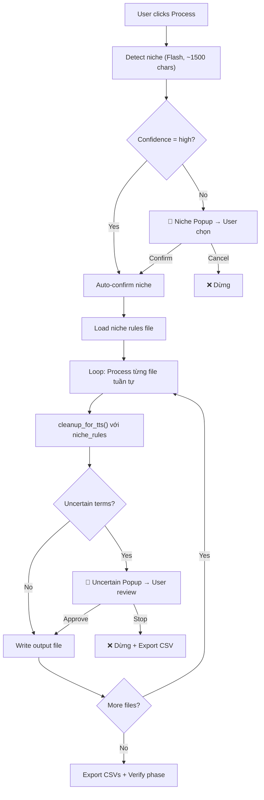

# Niche-Based TTS Cleanup — Walkthrough

## Changes Made

### New Files (3)

| File | Purpose |
|------|---------|
| [system_tts_detect_niche.txt](file:///F:/1.%20Edit%20Videos/8.AntiCode/2.Script_Split_Chapter/prompts/system_tts_detect_niche.txt) | Prompt nhẹ cho Flash model, detect niche từ ~1500 chars → JSON |
| [firearms.txt](file:///F:/1.%20Edit%20Videos/8.AntiCode/2.Script_Split_Chapter/prompts/tts_niche_rules/firearms.txt) | Rules cho cỡ nòng, model súng, thương hiệu, acronyms vũ khí |
| [history.txt](file:///F:/1.%20Edit%20Videos/8.AntiCode/2.Script_Split_Chapter/prompts/tts_niche_rules/history.txt) | Rules cho niên đại, triều đại, danh hiệu lịch sử |

### Modified Files (4)

| File | Changes |
|------|---------|
| [system_tts_cleanup.txt](file:///F:/1.%20Edit%20Videos/8.AntiCode/2.Script_Split_Chapter/prompts/system_tts_cleanup.txt) | +3 rules (em dash, quotation marks, thousands separator), `{NICHE_RULES}` placeholder, `---UNCERTAIN---` output section |
| [es/system_tts_cleanup.txt](file:///F:/1.%20Edit%20Videos/8.AntiCode/2.Script_Split_Chapter/prompts/es/system_tts_cleanup.txt) | Synced with English version |
| [tts_cleanup.py](file:///F:/1.%20Edit%20Videos/8.AntiCode/2.Script_Split_Chapter/core/tts_cleanup.py) | +4 functions: `detect_niche()`, `load_niche_rules()`, `get_available_niches()`, `export_uncertain_csv()`. Updated `cleanup_for_tts()` → 3-tuple return |
| [tts_tab.py](file:///F:/1.%20Edit%20Videos/8.AntiCode/2.Script_Split_Chapter/ui/tts_tab.py) | 2 new signals + events, 2 popup dialogs, sequential flow thay thế parallel ThreadPoolExecutor, updated `_do_stop()` + `_rewrite_failed()` |

---

## New Processing Flow

---

## Validation

- ✅ `python -m py_compile core/tts_cleanup.py` — OK
- ✅ `python -m py_compile ui/tts_tab.py` — OK
- ⏳ Manual testing with sample firearms script — pending (user)
