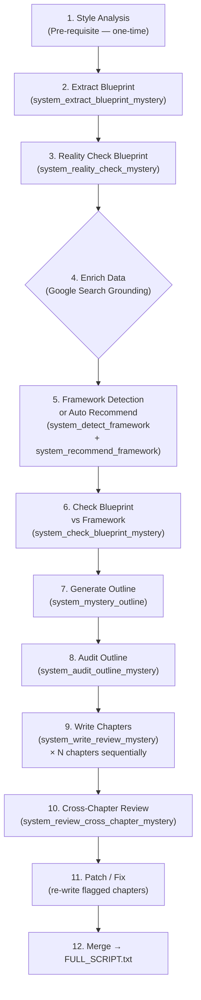

# Top/List Review Mode — Niche: Bí Ẩn Lịch Sử
## Framework & Pipeline Report

---

## 1. Niche Config

| Parameter | Value |
|---|---|
| **Niche** | `Review_bí_ẩn_lịch_sử` |
| **Language** | English |
| **Framework** | Auto (detect & switch) |
| **Tier** | Pro |
| **Threads** | 3 |
| **Country** | US |
| **Chapters** | 8–11 |
| **Hook WC** | 0–200 (up to 200w) |
| **Body WC** | 500+ (no upper cap) |
| **End WC** | 0–150 (up to 150w) |
| **Enrich Data** | ✅ |
| **Transitions** | ❌ |
| **Cut Video** | ❌ |
| **Price Check** | ❌ |
| **Excel Update** | ❌ |

**Niche Subcategories** (from [niches/bí_ẩn_lịch_sử.txt](file:///f:/1.%20Edit%20Videos/8.AntiCode/2.Script_Split_Chapter/niches/bí_ẩn_lịch_sử.txt)):

> Văn minh cổ đại, Các vụ mất tích lịch sử, Hội kín & Tổ chức bí mật, Bí ẩn về các vị vua, Khảo cổ "Cấm" & OOPArts, Bí ẩn quân sự, Mật mã chưa giải, Thần thoại & Sinh vật huyền bí, Thảm họa không lời giải, Kẻ mạo danh & Danh tính bí ẩn, Kho báu & Di vật linh thiêng, Lời nguyền, Bí ẩn dưới đại dương, Hiện tượng siêu nhiên, Âm mưu chính phủ, Cái chết bí ẩn.

---

## 2. Pipeline Steps (Execution Order)

### Step Details

| # | Step | Prompt File | Key Purpose |
|---|---|---|---|
| 1 | **Style Analysis** | `system_style_overview` → `system_style_detail` → `system_style_synthesis` → `system_style_synthesis_frameworks` | Pre-requisite: analyze reference scripts → extract voice DNA, techniques, openings/closings → generate style guide + 2–4 reusable frameworks |
| 2 | **Extract Blueprint** | [system_extract_blueprint_mystery.txt](file:///f:/1.%20Edit%20Videos/8.AntiCode/2.Script_Split_Chapter/prompts/system_extract_blueprint_mystery.txt) | Extract source-tagged mystery data: facts → `{source: "transcript"\|"ai_knowledge"}`. Includes `key_specs`, `detailed_facts`, `mainstream_theory`, `counter_evidence`, `named_sources` per mystery |
| 3 | **Reality Check** | [system_reality_check_mystery.txt](file:///f:/1.%20Edit%20Videos/8.AntiCode/2.Script_Split_Chapter/prompts/system_reality_check_mystery.txt) | 3 jobs: verify `ai_knowledge` fields (myth/anachronism/source accuracy), fix proper noun spelling (transliteration errors), enrich missing data → output `clean_blueprint` |
| 4 | **Enrich Data** | Google Search Grounding (Gemini API) | Optional — toggled by `enrich_data: true`. Searches Google to fill factual gaps in the blueprint |
| 5 | **Framework Select** | [system_detect_framework.txt](file:///f:/1.%20Edit%20Videos/8.AntiCode/2.Script_Split_Chapter/prompts/system_detect_framework.txt) + [system_recommend_framework.txt](file:///f:/1.%20Edit%20Videos/8.AntiCode/2.Script_Split_Chapter/prompts/system_recommend_framework.txt) | Auto mode: detect original framework → recommend best from style guide (scores: data_fit, topic_fit, product_count_fit, narrative_potential) |
| 6 | **Check Blueprint** | [system_check_blueprint_mystery.txt](file:///f:/1.%20Edit%20Videos/8.AntiCode/2.Script_Split_Chapter/prompts/system_check_blueprint_mystery.txt) | Verify blueprint has enough data for chosen framework: `READY` / `NEEDS_DATA` / `INSUFFICIENT`. Checks scenes, evidence, mainstream theory, counter-evidence per mystery |
| 7 | **Generate Outline** | [system_mystery_outline.txt](file:///f:/1.%20Edit%20Videos/8.AntiCode/2.Script_Split_Chapter/prompts/system_mystery_outline.txt) | Create chapter outline with **Sine Wave Tone Arc** + **7 Chapter Structures** + **4 Closing Types** (see §3–5 below). JSON output with `chapters[]`, `cta`, `mystery_escalation_map` |
| 8 | **Audit Outline** | [system_audit_outline_mystery.txt](file:///f:/1.%20Edit%20Videos/8.AntiCode/2.Script_Split_Chapter/prompts/system_audit_outline_mystery.txt) | QA: chapter count compliance, escalation order, mystery-per-chapter, hook/end structure, investigation elements completeness, word count, anti-repetition |
| 9 | **Write Chapters** | [system_write_review_mystery.txt](file:///f:/1.%20Edit%20Videos/8.AntiCode/2.Script_Split_Chapter/prompts/system_write_review_mystery.txt) | Sequential writing with context carry. Enforces assigned structure, closing type, vocabulary ban, 2nd-person immersion rules, Feynman vocabulary control |
| 10 | **Cross-Chapter Review** | [system_review_cross_chapter_mystery.txt](file:///f:/1.%20Edit%20Videos/8.AntiCode/2.Script_Split_Chapter/prompts/system_review_cross_chapter_mystery.txt) | 12-dimension quality check (see §6). Score ± issues per chapter |
| 11 | **Patch/Fix** | Same writer prompt | Targeted patching of flagged chapters — minimal edit, not full rewrite |
| 12 | **Merge** | — | Concatenate final chapters → `FULL_SCRIPT.txt` |

---

## 3. Macro Tone Arc (Sine Wave — Outline Step)

The outline **MUST** follow a sine wave of emotional intensity — **NOT** linear escalation.

| Position | Tone Slot | Purpose | Choose |
|---|---|---|---|
| #1 (first body) | **BANGER** | Capture attention, beat early drop-off | Most visually dramatic, visceral mystery |
| #2–3 | **FASCINATOR** | Reward viewers, stimulate curiosity | Scientifically astonishing, precision-based |
| #4–5 | **CREEP** | Change texture, institutional dread | Bureaucratic evil, document-based horror |
| #6 | **FASCINATOR** | Recovery, re-energize | Surprise discovery or paradigm shift |
| Penultimate | **EPIC** | Cinematic climax, peak energy | Largest scale, most spectacular |
| Final body | **PHILOSOPHICAL** | End with thought, not action | Deepest civilizational implications |

---

## 4. Chapter Structures (7 Types — Writer Step)

Each body chapter is assigned ONE structure. **No two consecutive chapters** may share the same structure.

| # | Structure | Pattern | Best For |
|---|---|---|---|
| 1 | **The Mythbuster** | Common belief → Scientific refutation → Real mystery | Popular misconceptions |
| 2 | **The Detective Trail** | Ancient record → Modern investigation → Chilling discovery | Mysteries with 21st-century lab analysis, DNA, archaeology |
| 3 | **The Bureaucratic Anomaly** | Build massive system → Zoom into absurd gap → Deliberate silence | Institutional mysteries with obsessive records |
| 4 | **The Eyewitness Report** | Witness account → Contemporary helplessness → Knowledge erased | Technologies that terrified conquerors |
| 5 | **The Conflicting Accounts** | Side A → Side B contradicts → Science reveals truth | Competing historical narratives |
| 6 | **The Ticking Clock** | Set doom clock → Last desperate acts → Permanent disappearance | Secrets that died with civilizations |
| 7 | **The Innocent Facade** | Harmless object → Peel back layers → Lethal reality | Weapons disguised as everyday objects |

---

## 5. Closing Types (4 Types — Writer Step)

Each body chapter is assigned ONE closing type. **No two consecutive chapters** may use the same.

| Type | Description | Example |
|---|---|---|
| **RHETORICAL_QUESTIONS** | 2–4 unresolved questions (vary quantity & format per chapter) | — |
| **COLD_FACT** | Stark, chilling factual statement. No questions. | "The castle is rubble. The library is ash." |
| **PHYSICAL_CONSEQUENCE** | What physically remains or has been permanently lost | "The eggshell is gone. The powder has scattered." |
| **IRONY** | The protector of the secret ultimately destroyed it | "The empire that guarded its formula so perfectly ensured that when it fell, the knowledge fell with it." |

**End chapter** always uses closing type **ECHO** — pull audience from past to present with callback closing.

---

## 6. Cross-Chapter Quality Review (12 Dimensions)

| # | Dimension | What It Checks |
|---|---|---|
| 1 | Data Consistency | Same dates/names/measurements across chapters |
| 2 | Citation Consistency | Same source cited consistently (name, year) |
| 3 | Content Duplication | Same evidence/question used in multiple chapters |
| 4 | Transitions | Natural flow, logical geo/temporal bridges |
| 5 | Escalation Consistency | Sine wave tone arc works across all chapters |
| 6 | Word Redundancy | Same pivot phrases, analogies, opening types reused |
| 7 | Missing Threads | Introduced theories/sources properly addressed |
| 8 | Structural Variety | Consecutive chapters use different structures |
| 9 | Pivot Phrase Diversity | No >2 chapters with same pivot template |
| 10 | Closing Type Variety | Closings rotate (questions, cold fact, consequence, irony) |
| 11 | 2nd-Person Context | Flag forced "You are..." in bureaucratic content |
| 12 | Vocabulary Density | Flag 2+ technical sentences without grounding analogy |

---

## 7. Writer Rules (Key Constraints)

- **Vocabulary Ban**: "investigation", "investigate", "case file", "dossier" — framework terminology must be invisible
- **2nd-Person Immersion**: Use "You are..." for discovery/danger/forbidden spaces; avoid for bureaucratic/scientific content
- **Feynman Technique**: Every technical term immediately followed by everyday analogy
- **Pivot Blacklist**: Each chapter must use a fundamentally different pivot construction
- **Bridge Formats**: 6 types (contrast, thematic link, question, cold open, callback, temporal) — rotate across chapters
- **Blueprint Data Only**: `key_evidence`, `mainstream_theory`, `core_impossibility` must come from blueprint, not AI knowledge

---

## 8. Storytelling Methods (Chapter-Level — from KI)

The system enforces ONE primary method per chapter for consistent voice:

| Method | Primary Hook | Atmospheric Goal | Ending Type |
|---|---|---|---|
| `inquiry_arc` | Logical investigation | Intellectual curiosity | Reflective / Objective |
| `cognitive_arc` | Internal psychological shift | Intellectual tension | Internal Realization |
| `relic_anchor` | Material/Physical discovery | Reverent / Mysterious | Weighted Silence |
| `descending_spiral` | Dark, unsettling mystery | Creeping unease | Hollow Silence |

**"Ghostly Voice" Mechanic** (`descending_spiral`): Uses an "invisible character" system — ghostly voices of historical figures + internal counter-arguments for psychological haunting without jump scares.

---

## 9. Key Functions in `rewriter.py`

| Function | Line | Role |
|---|---|---|
| `extract_blueprint_review()` | L1295 | Blueprint extraction — uses mystery prompt if `_is_mystery` |
| `reality_check_blueprint()` | L2130 | Verify + enrich blueprint data |
| `check_blueprint()` | L1936 | Check blueprint completeness vs framework |
| `detect_framework()` | L930 | Detect original script's framework |
| `recommend_framework()` | L1879 | Score & rank all style frameworks |
| `create_mystery_outline()` | L2569 | Generate mystery-specific outline (sine wave) |
| `audit_outline_review()` | L1341 | Audit outline structure & constraints |
| `write_review_chapter()` | L2840 | Write individual chapter — dispatches to mystery/firearms/military prompt |
| `review_cross_chapter()` | L1396 | 12-dimension cross-chapter quality check |
| `enrich_blueprint_google()` | L1155 | Google Search Grounding enrichment |
