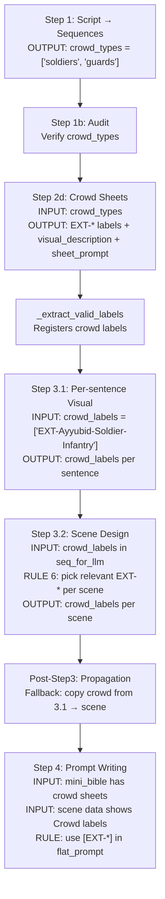

# Crowd Data Flow — Complete Trace

## Tóm tắt: Mỗi Step nhận/trả gì cho crowd?

## Chi tiết từng Step

### Step 1 → `crowd_types` per sequence
| Field | Ví dụ |
|---|---|
| `crowd_types` | `["soldiers", "guards"]` |

**Rules đã thêm**:
- Dedup: `soldiers` = `infantry` = `foot soldiers`
- Anti-state: `dying soldiers` → chỉ cần `soldiers`
- Max 5 types per sequence

---

### Step 2d → Crowd Character Sheets
| Field | Ví dụ |
|---|---|
| `label` | `EXT-Ayyubid-Soldier-Infantry` |
| `visual_description` | `BODY: 4.5 heads tall. COSTUME: Head: pointed steel helmet...` |
| `default_stance` | `stands at attention with spear` |
| `sheet_prompt` | `Character reference sheet, clean white background...` |

**Code normalize**: 26 types → 15 types (dedup + strip states)

---

### Step 3.1 → crowd_labels per sentence
| Input | Output |
|---|---|
| `crowd_labels: ["EXT-A-Soldier-Infantry", "EXT-C-Knight-Heavy"]` | Per sentence: `crowd_labels: ["EXT-A-Soldier-Infantry"]` |

**Q3b rule**: LLM picks which crowd types are visible in EACH sentence

---

### Step 3.2 → crowd_labels per scene
| Input | Output |
|---|---|
| `seq_for_llm.crowd_labels` | Per scene: `crowd_labels: ["EXT-A-Soldier-Infantry"]` |

**Rule 6** (UPDATED): pick ONLY visible EXT-* labels per scene
**Fallback**: if Step 3.2 LLM leaves empty → copy from Step 3.1

---

### Step 4 → flat_prompt references crowd
| Input | Effect |
|---|---|
| `mini_bible` includes crowd sheets | LLM can reference costume details |
| Scene data shows `Crowd: yes — EXT-A-Soldier-Infantry` | LLM knows which crowd to describe |
| Rule: `use [EXT-*] crowd character labels` | LLM writes crowd into flat_prompt |

## Bugs Found & Fixed

| # | Step | Bug | Root Cause | Fix |
|---|---|---|---|---|
| 1 | Step 3.2 | `seq_for_llm` missing `crowd_labels` | Forgot to add field | ✅ Added |
| 2 | Post-Step3 | crowd_labels not propagated from 3.1→scene | No fallback code | ✅ Added fallback |
| 3 | Step 3.2 Rule 6 | Only says `has_crowd=true/false`, no crowd_labels guidance | LLM doesn't know to fill | ✅ Expanded rule |
| 4 | Step 4 template | Says `crowd_archetypes` not `[EXT-*]` labels | Wrong reference name | ✅ Fixed |
| 5 | Step 2d output | Missing `sheet_prompt` | Not in JSON template | ✅ Added |
