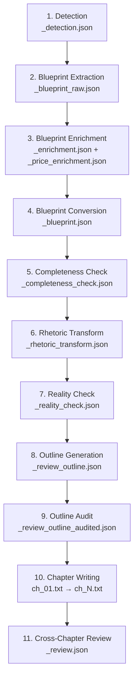

# Nghiên Cứu Chi Tiết: Script Creation Pipeline — Review Súng Đạn × The Deep Anatomy

## Tổng Quan Pipeline

Script Creation cho niche **Review Súng Đạn** sử dụng pipeline `review` (khác với pipeline `narrative` dùng cho Tiểu Sử, Hải Tặc, Trận Đánh). Pipeline chạy qua **10 bước tuần tự**, mỗi bước tạo ra 1 artifact JSON/CSV trong thư mục `_pipeline/`:



---

## Cấu Hình Niche

File: [Review_súng_đạn.json](file:///F:/1.%20Edit%20Videos/8.AntiCode/2.Script_Split_Chapter/niche_configs/Review_súng_đạn.json)

| Param | Giá trị | Ý nghĩa |
|---|---|---|
| `lang` | Tiếng Anh | Output bằng English |
| `framework` | **The Deep Anatomy** | Framework mặc định cho niche này |
| `tier` | Pro | Model tier (Pro vs Flash) |
| `ch_min` / `ch_max` | 8 / 11 | Số chapter tối thiểu/tối đa |
| `wc_open_min`/`max` | 0 / 250 | Word count cho Hook chapter |
| `wc_body_min`/`max` | 0 / 450 | Word count cho Body/Topic Block chapter |
| `wc_end_min`/`max` | 0 / 150 | Word count cho End chapter |
| `google_check` | true | Verify giá/spec bằng Google Search |
| `transitions` | false | Không thêm câu chuyển tiếp riêng biệt |

---

## Style JSON — Kiến Trúc Dữ Liệu

File: [Review_súng_đạn.json](file:///F:/1.%20Edit%20Videos/8.AntiCode/2.Script_Split_Chapter/styles/Review_súng_đạn.json) — **167KB, 2627 dòng**

### Tầng 1: Core Rules (áp dụng cho MỌI framework)

| Rule | Nội dung |
|---|---|
| `identity` | Pragmatic, authoritative expert — contrarian edge — trusted guide |
| `tone` | Authoritative + conversational, thay đổi theo `tonal_arc` |
| `sentence_rhythm` | Fast, driving pace: staccato 1-8 words cho impact, 15-25 words cho data |
| `vocabulary` | Technical jargon + visceral language, translate terms → tangible benefits |
| `pov_rules` | **2nd person** (you/your) + **3rd person** (the data shows). **FORBIDDEN**: 1st person (I/we) |
| `anti_copy` | Mọi claim phải backed by data, NO generic praise |
| `data_density` | Mỗi paragraph ≥ 1 con số cụ thể |
| `anti_framework_leak` | Framework terms NEVER xuất hiện trong output |
| `voice_over_clarity` | 1 idea/sentence, CLEAR subjects, NO nested clauses |

### Tầng 2: Tonal Arc — 6 tông cảm xúc

Mỗi chapter được gán 1 tone category:

| Tone | Khi nào | Cảm xúc |
|---|---|---|
| `comedic_roast` | Thiết kế thảm họa, meme-worthy | Cười/hoài nghi |
| `brutal_audit` | Sản phẩm đắt, hype nhưng fail | Sốc/phẫn nộ |
| `working_class_hero` | Rẻ, xấu nhưng hiệu suất cao | Respect/validation |
| `nerd_out` | Cơ chế lạ, sáng tạo | Fascination |
| `nostalgic_reverence` | Huyền thoại, battle-proven | Kính trọng |
| `macro_strategist` | Thay đổi cuộc chơi cả category | Awe |

### Tầng 3: Hook Methods — 3 kiểu mở đầu

1. **Damning Verdict First** — Verdict sốc ngay câu đầu
2. **Stress Test Cold Open** — Hành động bạo lực lên sản phẩm
3. **Provocative Caliber Question** — Câu hỏi gây tranh cãi

### Tầng 4: Frameworks — 7 khung kể chuyện

| # | Framework | Khi nào | Loại chapter |
|---|---|---|---|
| 1 | The Contrarian Takedown | So sánh leader vs challenger | `comparison` |
| 2 | The Underdog Champion | Budget/bị đánh giá thấp outperform | `myth_debunk` |
| 3 | The High-Stakes Scenario | Sản phẩm cho tình huống sống còn | `scenario_test` |
| 4 | The Legacy & Heritage | Cổ điển, huyền thoại, vẫn relevant | `product_evaluation` |
| 5 | The Budget Warrior | Top N giá rẻ nhất | `countdown` |
| 6 | The Catalog | Danh mục không xếp hạng | `catalog` |
| 7 | **The Deep Anatomy** | Deep-dive 1 sản phẩm duy nhất | **`topic_block`** |

---

## Framework "The Deep Anatomy" — Chi Tiết Đầy Đủ

> **Dòng 2194–2460** trong style JSON

### Khi Nào Dùng
- Blueprint chỉ chứa **1 sản phẩm chính** (1 khẩu súng, 1 loại đạn, 1 phụ kiện)
- Mục tiêu: **giáo dục toàn diện** — không so sánh, không xếp hạng
- Viewer hiểu sâu hơn 90% người dùng sản phẩm đó

### Cung Cảm Xúc (Emotional Arc)

```
Authority → Discovery → Mastery → Verdict
"Bạn nghĩ bạn biết"  →  "Nhưng bạn không biết ĐIỀU NÀY"  →  "Giờ bạn hiểu sâu hơn hầu hết"  →  "Đây là khi nên / không nên dùng"
```

### Cấu Trúc 3 Hồi

| Hồi | Tỷ lệ | Nội dung |
|---|---|---|
| Act 1: The Foundation | 10-15% | Hook + thiết lập identity |
| Act 2: The Anatomy | 70-80% | Topic block chapters, mỗi chapter 1 facet |
| Act 3: The Verdict | 10-15% | Scenario verdict + Tribal CTA |

### Kiểu Chapter: `topic_block`

Khác với các framework khác (1 sản phẩm/chapter hoặc 1 tiêu chí/chapter), Deep Anatomy dùng **1 khía cạnh (facet)/chapter** — phân tích DUY NHẤT 1 sản phẩm từ nhiều góc:

### Topic Pool — 10 Topic Blocks Có Sẵn

| Topic | Khi nào dùng | Vị trí |
|---|---|---|
| Origin & Birth | Blueprint có lịch sử, bối cảnh tạo ra | Đầu |
| Core Specs & Ballistics | Có specs định lượng (PSI, fps, grain...) | Đầu-giữa |
| Recoil & Shootability | Có data recoil, áp suất | Giữa |
| Terminal Performance | Wound channel, penetration, stopping power | Giữa |
| Platform Versatility | Sản phẩm dùng trên nhiều platform | Giữa |
| Variants & Evolution | Có biến thể, phiên bản cải tiến | Giữa-cuối |
| Tactical Application | Tactical scenarios, military/LE use | Giữa-cuối |
| Handloading & Customization | Dữ liệu reload, aftermarket | Cuối |
| Myth vs Reality | Diệu ngôn phổ biến mà data bác bỏ | Bất kỳ |
| **Limitations & Trade-offs** | **LUÔN LUÔN có** | Cuối |

### Template Viết — 5 Phần Tử BẮT BUỘC Mỗi Topic Block

```
[TOPIC ANCHOR]        → 1 câu sắc bén, KHÔNG generic ("let's talk about...")
                        Dùng claim/myth attack/surprising angle

[DATA FOUNDATION]     → 1-3 con số từ blueprint + LUÔN có ĐƠN VỊ
                        LUÔN so sánh: "21,000 PSI — barely half the 9mm's 35,000"

[PHYSICAL TRANSLATION] → ★ KỸ THUẬT CHỦ ĐẠO — BẮT BUỘC ★
                        Chuyển MỌI con số → cảm giác vật lý
                        BAD: "Recoil is manageable"
                        GOOD: "It doesn't slap — gives a solid straight-back push,
                               like palming a basketball vs catching a fastball"
                        Mỗi chapter PHẢI dùng 1 sensory comparison KHÁC NHAU

[PROOF LAYER]         → Bằng chứng thực tế
                        ✅ Scenario painting TỰ XÂY từ specs
                        ✅ Adoption records, số liệu quân đội
                        ❌ KHÔNG copy case study/anecdote từ transcript gốc

[PRACTICAL IMPLICATION] → "If you are [situation], this means [consequence for you]"
```

### 4 Pattern Viết — Xoay Vòng Bắt Buộc

| Pattern | Lead Element | Tốt nhất cho |
|---|---|---|
| T1: DATA LEAD | Data → Physical Translation → Proof → Practical | Specs, ballistics, pressure |
| T2: MYTH LEAD | Myth attack → Data disproof → Physical → Proof | Recoil myths, misconceptions |
| T3: STORY LEAD | Opening scenario → Data why → Physical → Practical | History, tactical, combat |
| T4: CATALOG LEAD | Topic anchor → Rapid list → Data standout → Practical | Variants, platforms, handloading |

> **RULE**: Không dùng cùng pattern cho 2 chapter liên tiếp.

### Kỹ Thuật Viết — Mức Độ Ưu Tiên

| Mức | Kỹ thuật |
|---|---|
| **Dùng NHIỀU** | Physical Translation (BẮT BUỘC), Data-Driven Substantiation, Visceral Analogy, Scenario Painting |
| Dùng vừa | Appeal to Authority, Anticipatory Rebuttal, Tribal Enemy Framing (max 1-2/script) |
| Dùng ít | Contrast & Direct Comparison, Feature-to-Benefit Translation |

### Cách Kết Thúc — Tribal CTA (BẮT BUỘC)

```
1. Recap 1-2 killer strengths
2. Acknowledge 1 core limitation
3. Verdict by SITUATION: "If [situation A] → this is your answer. If [situation B] → look elsewhere."
4. Iconic closing line — 1 câu capture product identity
5. ★ TRIBAL CTA ★: 1 câu hỏi buộc viewer PICK A SIDE hoặc SHARE PERSONAL SETUP
   BAD: "What do you think?"
   GOOD: "What's on YOUR nightstand right now — .45 or 9mm? Drop it and defend your choice."
```

---

## Ví Dụ Mẫu: Barrett M107A1 .50 BMG

Video gốc: [Every Civilian Should Own A 50 BMG](https://youtube.com/watch?v=oIydRaroSQs) — Garand Thumb

### Pipeline Artifacts Thực Tế

#### Step 1: Detection
```json
{
  "detected_framework": "The Deep Anatomy",
  "confidence": "high",
  "reasoning": "The script provides a comprehensive, technical breakdown of a single firearm (the M107A1)..."
}
```

#### Step 2-4: Blueprint
- **1 sản phẩm**: Barrett M107A1
- **Key specs**: .50 BMG, ~30 lbs, 29" barrel, 10 rounds, 7-9 lbs trigger
- **Benchmark**: Barrett M82A1 (predecessor)
- **alternative_rhetoric**: 5 original angles (industrial piston analogy, extreme-environment endurance, coastal storage scenario, NP3 friction advantage)
- **key_claims**: 50 rounds break-in, 3-5 MOA with M33 ball, 8K-15K barrel life, 2,700-2,800 fps

#### Step 8: Outline — 8 Chapters

| # | Type | Title | Topic Block | Emotional Beat |
|---|---|---|---|---|
| 1 | `hook` | The Civilian Artillery Paradox | — | Authority/Discovery |
| 2 | `topic_block` | Beyond the M82: The Evolution of a Behemoth | Origin & Birth | Intrigue |
| 3 | `topic_block` | The Physics of .50 BMG | Core Specs & Ballistics | Awe |
| 4 | `topic_block` | Taming the Industrial Piston | Recoil & Shootability | Surprise |
| 5 | `topic_block` | Anti-Materiel Reality | Terminal Performance | Respect |
| 6 | `topic_block` | The Coastal Endurance Test | Tactical Application | Validation |
| 7 | `topic_block` | The $14,000 Reality Check | Limitations & Trade-offs | Reality Check |
| 8 | `end` | The Ultimate Contingency | — | Empowerment |

**Thesis**: *"While the Barrett M107A1 is universally recognized as a military powerhouse, its true value lies in its extreme-environment endurance engineering..."*

### Ví Dụ Output Chapters

#### Ch01 Hook — The Civilian Artillery Paradox
> The Barrett .50 BMG has been dismantling vehicles and shattering concrete for decades... **The true value of the M107A1 isn't just raw, concussive power. It is about extreme-environment endurance.** ...The real secret hides in the chemical engineering.

→ Hook dùng `authority_legacy`, giới thiệu NP3 coating angle thay vì lặp lại narrative "civilian should own 50 cal" của video gốc.

#### Ch04 Topic Block — Taming the Industrial Piston (Recoil & Shootability)
> Most people assume firing a .50 BMG requires bracing for a car crash. The reality is entirely different.

Sử dụng **Pattern T2 (MYTH LEAD)**: Myth attack → Data → Physical Translation:

- **[TOPIC ANCHOR]**: Myth attack — "requires bracing for a car crash"
- **[DATA FOUNDATION]**: NP3 coating, recoil-operated action, 28.7 lbs, cylindrical muzzle brake
- **[PHYSICAL TRANSLATION]**: *"less like catching a fastball barehanded, more like catching a heavy medicine ball thrown at your chest"*
- **[PROOF LAYER]**: *"Racking the charging handle... feels like dragging a cinderblock across gravel. Here, the chemistry dictates the mechanics"*
- **[PRACTICAL IMPLICATION]**: *"If you are tasked with delivering rapid, successive hits on a hardened target, this recoil mitigation changes your entire operational timeline"*

#### Ch07 Topic Block — The $14,000 Reality Check (Limitations & Trade-offs)
> Owning the Barrett M107A1 requires accepting a level of logistical and financial punishment...

- **[PHYSICAL TRANSLATION]**: *"Moving the M107A1 feels like lugging a fully loaded steel toolbox welded to a length of industrial rebar"*
- Honest limitations: $11,905 street price, 30 lbs, 57", $50-80 per 10-round dump

#### Ch08 End — The Ultimate Contingency
> The Barrett M107A1 is not a precision range toy; it is an extreme-environment demolition tool.

- **Verdict by situation**: "If you need mobile → look elsewhere. If static contingency → this is your answer."
- **Iconic closing**: *"You don't buy an M107A1 to shoot groups; you buy it because it is the ultimate industrial insurance policy."*
- **Tribal CTA**: *"Do you see a place for a .50 BMG in a civilian safe, or is a .308 enough?"*

---

## Prompt Files Liên Quan

| File | Vai trò |
|---|---|
| [system_detect_framework.txt](file:///F:/1.%20Edit%20Videos/8.AntiCode/2.Script_Split_Chapter/prompts/system_detect_framework.txt) | Phát hiện framework từ transcript |
| [system_extract_blueprint_firearms.txt](file:///F:/1.%20Edit%20Videos/8.AntiCode/2.Script_Split_Chapter/prompts/system_extract_blueprint_firearms.txt) | Trích xuất blueprint data |
| [system_enrich_blueprint_firearms.txt](file:///F:/1.%20Edit%20Videos/8.AntiCode/2.Script_Split_Chapter/prompts/system_enrich_blueprint_firearms.txt) | Làm giàu data (prices, alternatives) |
| [system_review_outline_firearms.txt](file:///F:/1.%20Edit%20Videos/8.AntiCode/2.Script_Split_Chapter/prompts/system_review_outline_firearms.txt) | Tạo outline (có section riêng cho `topic_block`) |
| [system_audit_outline_firearms.txt](file:///F:/1.%20Edit%20Videos/8.AntiCode/2.Script_Split_Chapter/prompts/system_audit_outline_firearms.txt) | Kiểm tra chất lượng outline |
| [system_write_review_firearms.txt](file:///F:/1.%20Edit%20Videos/8.AntiCode/2.Script_Split_Chapter/prompts/system_write_review_firearms.txt) | Viết chapter (có section riêng cho `topic_block`) |
| [system_review_cross_chapter_firearms.txt](file:///F:/1.%20Edit%20Videos/8.AntiCode/2.Script_Split_Chapter/prompts/system_review_cross_chapter_firearms.txt) | Review chéo giữa các chapters |
| [system_reality_check_firearms.txt](file:///F:/1.%20Edit%20Videos/8.AntiCode/2.Script_Split_Chapter/prompts/system_reality_check_firearms.txt) | Fact-check specs/prices |
| [system_transform_rhetoric_firearms.txt](file:///F:/1.%20Edit%20Videos/8.AntiCode/2.Script_Split_Chapter/prompts/system_transform_rhetoric_firearms.txt) | Tạo alternative_rhetoric angles |

---

## Key Takeaways

### Điểm Đặc Biệt Của "The Deep Anatomy"

1. **Single product, multiple facets** — Không giống các framework khác (multi-product), Deep Anatomy phân tích 1 sản phẩm qua 6-8 topic blocks
2. **`topic_block` chapter type** — Type riêng biệt trong cả outline prompt và writing prompt, có rules khác hoàn toàn so với `body` chapters
3. **Physical Translation là KỸ THUẬT CHỦ ĐẠO** — Mọi con số PHẢI được chuyển thành cảm giác vật lý. Đây là "chữ ký" của framework này
4. **Tribal CTA BẮT BUỘC** — Kết thúc phải có câu hỏi buộc viewer pick a side, không phải generic "what do you think?"
5. **Topic pool selection** — Outline step chọn 6-8 topics từ pool 10 topics dựa trên blueprint data thực tế
6. **4 writing patterns (T1-T4)** — Xoay vòng bắt buộc, không được lặp pattern giữa 2 chapter liên tiếp
7. **alternative_rhetoric làm LEAD ANGLE** — Mỗi chapter's `depth_focus` phải lấy từ alternative_rhetoric, đảm bảo góc nhìn MỚI so với video gốc
