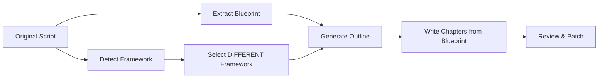

# Walkthrough — Framework-Aware Rewrite Pipeline

## Problem
The old Renew pipeline sent the **full original text** to the AI, resulting in paraphrased copies rather than genuinely new content.

## Solution
A 7-step pipeline that **never sends original text** to the writing AI:

## Changes Made

### New Files
| File | Purpose |
|------|---------|
| [system_detect_framework.txt](file:///f:/1.%20Edit%20Videos/8.AntiCode/2.Script_Split_Chapter/prompts/system_detect_framework.txt) | Detect which of 5 frameworks the original uses |
| [system_extract_blueprint.txt](file:///f:/1.%20Edit%20Videos/8.AntiCode/2.Script_Split_Chapter/prompts/system_extract_blueprint.txt) | Extract facts/events/themes — no original text |
| [system_write_from_blueprint.txt](file:///f:/1.%20Edit%20Videos/8.AntiCode/2.Script_Split_Chapter/prompts/system_write_from_blueprint.txt) | Write chapter from blueprint + style + framework |
| [cinematic_military_v2.json](file:///f:/1.%20Edit%20Videos/8.AntiCode/2.Script_Split_Chapter/styles/cinematic_military_v2.json) | Style guide with 5 rich frameworks |

### Modified Files
| File | Changes |
|------|---------|
| [rewriter.py](file:///f:/1.%20Edit%20Videos/8.AntiCode/2.Script_Split_Chapter/core/rewriter.py) | Added `detect_framework()`, `extract_blueprint()`, `generate_renew_outline_v2()`, `write_from_blueprint()` |
| [rewrite_style_tab.py](file:///f:/1.%20Edit%20Videos/8.AntiCode/2.Script_Split_Chapter/ui/rewrite_style_tab.py) | Updated `_do_renew_style()` to use 7-step pipeline + new imports |

### The 5 Frameworks
1. **The Investigative Deep-Dive** — Shock → Rewind → Build → Climax → Legacy
2. **The Domino Chain** — Small trigger → cascading cause-effect → collapse
3. **The Zoom Lens** — Satellite → Map → Street → Microscope → Pull Back
4. **The Trial** — Prosecution vs Defense → Evidence → Verdict
5. **The Pendulum** — Glory ↔ Cost oscillation → Still Point

Each framework contains: structure, hook, POV strategy, pacing, language, outline rules, steps, tension curve, cliffhanger types, technique emphasis, counter-argument, anti-patterns.

## Verification
- ✅ `rewriter.py` syntax check passed
- ✅ `rewrite_style_tab.py` syntax check passed
- ⏳ Manual test with real scripts pending (user needs to run)
