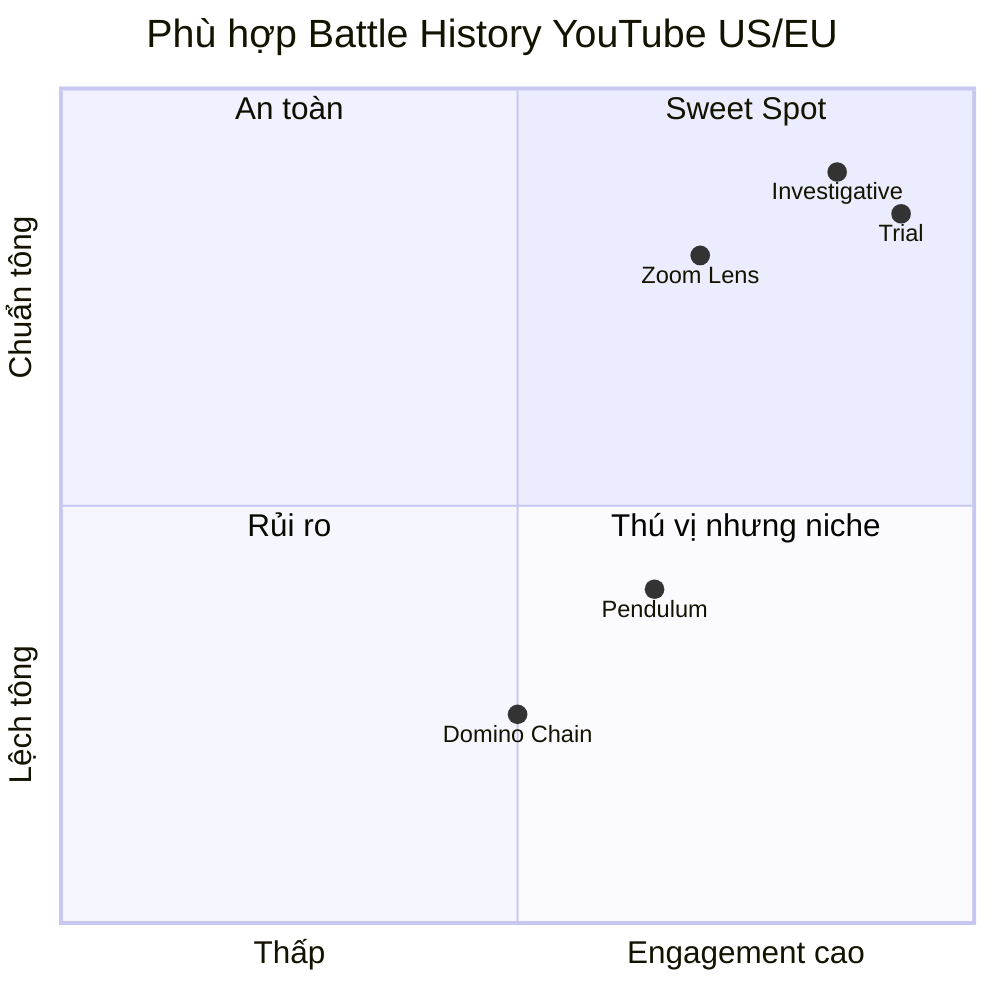

# 5 Framework — Narrative Phân Tích Trận Đánh

## 1. The Investigative Deep-Dive ⭐⭐⭐⭐⭐

| | |
|--|--|
| **Dùng khi** | Kết cục bất ngờ, thảm khốc, hoặc underdog victory |
| **Arc** | Shock → Analytical Rewind → Rising Tension → Climax → Legacy |
| **Cấu trúc** | 4 Acts: Reveal (ngắn) → Rewind (sâu) → Build (chính) → Legacy |
| **Hook** | In Medias Res — mở bằng kết cục sốc → "How did this happen?" |
| **POV** | 3rd omniscient → zoom vào nhân vật khi gần climax |
| **Thế mạnh** | Công thức chuẩn YouTube lịch sử (Kings & Generals, Invicta). Mystery → Reveal giữ chân cực tốt |
| **Rủi ro** | Phổ biến → có thể cảm thấy generic nếu không có chi tiết mới |
| **Phù hợp US/EU** | ✅ Rất cao — khán giả quen format này |

---

## 2. The Domino Chain ⭐⭐½

| | |
|--|--|
| **Dùng khi** | Chuỗi nhân quả từ trigger nhỏ → thảm họa lớn |
| **Arc** | Curiosity → Unease → Growing Dread → Inevitability → Impact |
| **Cấu trúc** | 3 Acts: First Push (ngắn) → Cascade (chính, mỗi ch = 1 domino) → Collapse |
| **Hook** | Hậu quả khổng lồ → rewind về trigger tầm thường |
| **POV** | 3rd omniscient, mỗi ch thu hẹp dần vào 1 nhân vật bị cuốn |
| **Thế mạnh** | Irony gap mạnh, xây dựng dread tốt |
| **Rủi ro** | **Cấm "A vs B" framing** và **cấm blame cá nhân** → lệch tông với battle history nơi khán giả muốn thấy tướng lĩnh đối đầu |
| **Phù hợp US/EU** | ⚠️ Thấp cho battle history — phù hợp hơn cho political disasters (WWI trigger, Fall of Rome) |

> [!WARNING]
> Anti-pattern "Do NOT use traditional 'A vs B' framing" trực tiếp mâu thuẫn với battle history nơi hai bên đối đầu là cốt lõi câu chuyện.

---

## 3. The Zoom Lens ⭐⭐⭐⭐

| | |
|--|--|
| **Dùng khi** | Sự kiện có nhiều tầng scale — từ đế chế xuống 1 người lính |
| **Arc** | Awe → Clarity → Familiarity → Intimacy → Catharsis → Grandeur |
| **Cấu trúc** | 4 Acts: Satellite (ngắn) → Map (context) → Street (action) → Microscope (human) + Pull Back |
| **Hook** | ~~Scale Countdown~~ → **Intimate-First** — mở bằng 1 chi tiết micro cực kỳ cụ thể → zoom out ra scale khổng lồ |
| **POV** | 3rd omniscient thu hẹp dần (empire → army → unit → soldier) |
| **Thế mạnh** | Dan Carlin / Hardcore History style. Cho phép vừa phân tích chiến lược vừa kể chuyện cá nhân |
| **Rủi ro** | Phần satellite đầu có thể mất khán giả nếu quá dài |
| **Phù hợp US/EU** | ✅ Cao — khán giả engaged thích deep-dive đa tầng |

---

## 4. The Trial ⭐⭐⭐⭐⭐

| | |
|--|--|
| **Dùng khi** | Sự kiện có nhiều cách hiểu — popular narrative bị oversimplified, "genius" thực ra là luck |
| **Arc** | Confidence → Doubt → Discovery → Conflicted → Nuanced Understanding |
| **Cấu trúc** | 5 Acts: Popular Story → Case FOR → Case AGAINST → Hidden Evidence → Full Picture |
| **Hook** | Bold Contrarian — nói điều ai cũng tin → phá sập trong 1 câu |
| **POV** | 3rd omniscient impartial guide, trình bày cả 2 phía |
| **Thế mạnh** | "Everything you know is wrong" = click magnet. Cognitive dissonance giữ chân cực mạnh |
| **Rủi ro** | Cần battle có đủ ambiguity. Nếu 1 phía rõ ràng đúng → framework mất tác dụng |
| **Phù hợp US/EU** | ✅ Rất cao — debunking/revisionism rất popular trên YouTube |

---

## 5. The Pendulum ⭐⭐⭐

| | |
|--|--|
| **Dùng khi** | Glory + tragedy đan xen — chiến thắng có cái giá kinh hoàng |
| **Arc** | Triumph → Horror → Triumph → Deeper Horror → Exhaustion → Somber Understanding |
| **Cấu trúc** | 3 Acts: Bright Side → Contrast (chính, dao động mạnh dần) → Full Picture |
| **Hook** | ~~Glory-Horror Collision~~ → **Horror-First** — mở bằng atrocity → pivot sang glory → shadow sentence |
| **POV** | 3rd omniscient với temperature shifts (warm admiring ↔ cold unflinching) |
| **Thế mạnh** | Emotional complexity cao nhất. Open ending tạo suy ngẫm |
| **Rủi ro** | Khán giả battle history **muốn celebrate epic victories** → Pendulum liên tục phá vỡ. Có thể cảm thấy moralistic/preachy |
| **Phù hợp US/EU** | ⚠️ Trung bình — chỉ phù hợp khi moral ambiguity LÀ core (atomic bomb, Cortés vs Aztecs) |

---

## Tổng kết nhanh

