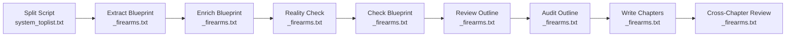

# Review: Prompt Viết Nội Dung Niche Súng Đạn — Mode Top/List

## Pipeline Overview

Niche "Review_súng_đạn" sử dụng pipeline **Review (Top/List)** với flow sau:



**Files reviewed:**

| # | File | Size | Purpose |
|---|------|------|---------|
| 1 | [system_toplist.txt](file:///f:/1.%20Edit%20Videos/8.AntiCode/2.Script_Split_Chapter/prompts/system_toplist.txt) | 1.4KB | Split script into chapters |
| 2 | [system_extract_blueprint_firearms.txt](file:///f:/1.%20Edit%20Videos/8.AntiCode/2.Script_Split_Chapter/prompts/system_extract_blueprint_firearms.txt) | 6.2KB | Extract product data from script |
| 3 | [system_enrich_blueprint_firearms.txt](file:///f:/1.%20Edit%20Videos/8.AntiCode/2.Script_Split_Chapter/prompts/system_enrich_blueprint_firearms.txt) | 2.0KB | Fill empty fields with AI knowledge |
| 4 | [system_reality_check_firearms.txt](file:///f:/1.%20Edit%20Videos/8.AntiCode/2.Script_Split_Chapter/prompts/system_reality_check_firearms.txt) | 3.9KB | Verify ai_knowledge, detect fudd-lore |
| 5 | [system_check_blueprint_firearms.txt](file:///f:/1.%20Edit%20Videos/8.AntiCode/2.Script_Split_Chapter/prompts/system_check_blueprint_firearms.txt) | 2.2KB | Check data completeness vs framework |
| 6 | [system_review_outline_firearms.txt](file:///f:/1.%20Edit%20Videos/8.AntiCode/2.Script_Split_Chapter/prompts/system_review_outline_firearms.txt) | 10.0KB | Create chapter outline |
| 7 | [system_audit_outline_firearms.txt](file:///f:/1.%20Edit%20Videos/8.AntiCode/2.Script_Split_Chapter/prompts/system_audit_outline_firearms.txt) | 3.0KB | Audit outline before writing |
| 8 | [system_write_review_firearms.txt](file:///f:/1.%20Edit%20Videos/8.AntiCode/2.Script_Split_Chapter/prompts/system_write_review_firearms.txt) | 11.6KB | Write each chapter |
| 9 | [system_review_cross_chapter_firearms.txt](file:///f:/1.%20Edit%20Videos/8.AntiCode/2.Script_Split_Chapter/prompts/system_review_cross_chapter_firearms.txt) | 2.4KB | Cross-chapter consistency check |
| 10 | [Review_súng_đạn.json](file:///f:/1.%20Edit%20Videos/8.AntiCode/2.Script_Split_Chapter/styles/Review_súng_đạn.json) | 145KB | Style guide (10 frameworks) |
| 11 | [Review_súng_đạn.json (config)](file:///f:/1.%20Edit%20Videos/8.AntiCode/2.Script_Split_Chapter/niche_configs/Review_súng_đạn.json) | 273B | Niche configuration |

---

## 🔴 Critical Issues

### 1. POV Contradiction: Style Guide vs Writer Prompt

> [!CAUTION]
> **Style guide** chứa `pov_strategy` trong nhiều framework cho phép first-person ("First-person expert", "I've tested both extensively", "When I stripped this down"). Nhưng **Writer prompt** (rule #2) cấm tuyệt đối first-person.

**Trong style guide (line 161-172, 340-351, 520-535, 706-720, 1102-1117, 1280-1295, 1463-1475, 1642-1655, 1818-1831):**

```json
"pov_strategy": {
    "default": "First-person expert — 'I've tested both extensively'",
    "shifts": [{"to": "First-person plural", "when": "Data analysis sections"}]
}
```

**Trong writer prompt (line 144):**
```
POV: Use ONLY second person ("you/your") and third person ("the data shows").
Do NOT use first person ("I", "we", "our tests", "my verdict").
The AI has not tested anything — never claim otherwise.
```

**Hậu quả:** AI nhận 2 chỉ dẫn đối ngược — kết quả phụ thuộc vào model nào ưu tiên cái nào. Với Gemini, thường writer prompt thắng nhưng không chắc chắn.

**Đề xuất:** Xóa hoặc cập nhật tất cả `pov_strategy` trong style guide để match với writer prompt:
- `"default": "Second-person + third-person data presenter"`
- Xóa tất cả `"First-person expert"`, `"First-person singular"`, `"First-person plural"`
- Cập nhật tất cả `example_approach` chứa "I" (ví dụ: "I've put 5,000 rounds through each" → "After 5,000 rounds through each")

---

### 2. `core_rules.pov_rules` vs Framework `pov_strategy` — Internal Style Guide Conflict

> [!WARNING]
> `core_rules.pov_rules` (line 11) nói rất rõ "FORBIDDEN: First person". Nhưng mỗi framework lại có `pov_strategy.default` cho phép first-person. Đây là mâu thuẫn **bên trong chính style guide**.

Frameworks bị ảnh hưởng:
- **The Contrarian Takedown** (line 162): `"First-person expert — 'I've tested both extensively'"`
- **The Underdog Champion** (line 341): `"First-person expert who personally tested the product"`
- **The High-Stakes Scenario** (line 521): `"Second-person for scenario, first-person expert for analysis"`
- **The Legacy & Heritage** (line 706): `"Third-person historical narrator shifting to first-person expert analyst"`
- **The Tier List** (line 923): `"First-person expert who has tested every item on the list"`
- **The Myth Buster** (line 1103): `"First-person expert investigator"`
- **The Evolution Timeline** (line 1280): `"first-person expert for modern gens"`
- **The Head-to-Head Duel** (line 1464): `"First-person expert who owns and has tested both"`
- **The Industry Shakeup** (line 1643): `"Third-person objective"` ← OK
- **The Budget Warrior** (line 1819): `"second-person direct address"` ← OK

**Chỉ 2/10 frameworks** không mâu thuẫn với `core_rules.pov_rules`.

---

### 3. Missing Niche File: `niches/súng_đạn.txt`

> [!IMPORTANT]
> Folder `niches/` chỉ có `bí_ẩn_lịch_sử.txt` và `trang_thiết_bị_quân_sự.txt`. **Không có** `súng_đạn.txt`.

File này được dùng bởi `system_tts_detect_niche.txt` để nhận dạng niche tự động. Thiếu file này có thể gây lỗi khi TTS pipeline cần detect niche.

Không ảnh hưởng trực tiếp đến rewrite pipeline vì niche được detect qua `topic_keywords` trong style guide.

---

## 🟡 Medium Issues

### 4. Style Guide Checklist Contradicts Catalog Framework

`checklist.always[0]` (line 2269):
```
"Use a reverse-chronological countdown list format (e.g., 10 to 1)."
```

Nhưng **The Catalog** framework (line 1969) explicitly nói:
```
"Do NOT rank or imply hierarchy — numbering is for identification only"
```

**Đề xuất:** Sửa checklist thành: "Use format phù hợp framework — countdown cho ranked frameworks, numbering tự nhiên cho Catalog."

---

### 5. Extract Blueprint — `product_name` Instruction Focuses on Military

Line 25 trong `system_extract_blueprint_firearms.txt`:
```
For military hardware, use the NATO or manufacturer designation
(e.g., "Plastun-SN" not "Transporte ligero Plaston-S")
```

Prompt này **shared với military** (cả 2 file giống hệt nhau: 6,240 bytes). Ví dụ military-specific không gây lỗi cho firearms, nhưng nên thêm ví dụ đặc thù cho súng:
```
For commercial firearms, use brand + model (e.g., "Glock 19 Gen 5" not "La Glock compacta")
```

---

### 6. Enrich Blueprint Prompt — Quá Generic

`system_enrich_blueprint_firearms.txt` (40 lines) là prompt ngắn nhất trong pipeline. So sánh với reality check (90 lines), nó thiếu:

- Không có **Fudd-lore detection** cho data mới thêm vào
- Không có **confidence tagging** cho enriched data
- Không có hướng dẫn cụ thể cho firearms (ví dụ: "For caliber conversion data, use SAAMI specs only")
- Không có **anti-hallucination** rule cho AI-generated specs

> [!NOTE]
> Reality check ở bước sau sẽ bắt lỗi, nhưng tốt hơn nếu enrich prompt đã có guardrails.

---

### 7. Writer Prompt Rule #11 — Countdown Numbering Restriction

Line 153:
```
COUNTDOWN NUMBERING: Only use "Number X" opening if framework name is
"The Budget Warrior" or "The Tier List".
```

Nhưng **The Industry Shakeup** cũng là countdown type và sử dụng numbering trong transitions:
```
"But what if you need something that lives in your waistband? Number 9, the..."
```

**Đề xuất:** Thêm "The Industry Shakeup" vào danh sách được phép dùng countdown numbering, hoặc sửa cliffhanger_types của Industry Shakeup để không dùng "Number X".

---

### 8. Writer Prompt Rule #13 — Parenthetical Translation Ban

Line 155:
```
NO PARENTHETICAL TRANSLATIONS: Never add English terms in parentheses
like "retroceso directo (direct blowback)"
```

Rule này rất tốt cho niche Español, nhưng nó **hardcoded trong prompt** thay vì tham chiếu `{lang}`. Nếu lang = English, rule này vô nghĩa. Nếu lang = Vietnamese, example cũng cần thay đổi.

**Đề xuất:** Thêm context: `"This rule applies when writing in non-English: ..."`

---

## 🟢 Strengths & Good Patterns

### ✅ Fudd-Lore Detection (Reality Check)

Rất tốt. Liệt kê cụ thể các lỗi phổ biến:
- Winchester 94 Angle Eject (post-1982)
- .45 vs 9mm stopping power myth
- AK accuracy myths
- .223 "varmint round" myth
- AR-15 reliability myth

Đây là **unique value** mà niche khác không có.

### ✅ Tonal Arc System

6 tonal categories (comedic_roast, brutal_audit, working_class_hero, nerd_out, nostalgic_reverence, macro_strategist) mỗi cái có:
- `when` (khi nào dùng)
- `tone` (giọng điệu)
- `example_products` (ví dụ cụ thể)
- `anti_hallucination_per_tone` (anti-hallucination riêng theo tone)

Hệ thống này tạo ra **variation tốt** giữa các chapter.

### ✅ 10 Frameworks — Rất Đa Dạng

| Framework | Type | Khi dùng |
|-----------|------|----------|
| The Contrarian Takedown | comparison | Phản biện sản phẩm phổ biến |
| The Underdog Champion | myth_debunk | Budget product vượt kỳ vọng |
| The High-Stakes Scenario | scenario_test | Home defense, duty use |
| The Legacy & Heritage | product_evaluation | Vũ khí kinh điển |
| The Tier List | countdown | Top 10 ranked list |
| The Myth Buster | investigation | Bắn phá huyền thoại |
| The Evolution Timeline | chronological | Dòng sản phẩm qua các đời |
| The Head-to-Head Duel | round_based | 2 sản phẩm so kèo |
| The Industry Shakeup | countdown | Sản phẩm mới ra mắt |
| The Budget Warrior | countdown | Best budget picks |
| The Catalog | catalog | Giới thiệu không xếp hạng |

### ✅ Anti-Framework-Leak Rule

`core_rules.anti_framework_leak` (line 14) ngăn AI lộ framework terminology ra output. Rất quan trọng vì viewer không cần biết đang dùng "The Contrarian Takedown".

### ✅ Source Tagging System (Blueprint)

`{"fact": "...", "source": "transcript|ai_knowledge"}` cho phép reality check verify chỉ phần AI thêm vào, không sửa data gốc. Hệ thống này rất mature.

### ✅ Debate Seed Mechanism

Outline có `debate_seed` — AI chọn 1 fact gây tranh cãi từ blueprint và writer chèn vào tự nhiên. Tạo engagement mà không cần fabricate controversy.

### ✅ Body Chapter Pattern System

4 patterns (Identity First, Problem First, Verdict First, Spec Shock) cho phép vary chapter structure based on `tone_category`. Rất tốt cho preventing repetitive flow.

### ✅ Structural Variety Rule (Rule #14)

Rule yêu cầu pivot, closer, và transition sentences **phải khác cấu trúc ngữ pháp** so với chapter trước. Đây là rule rất cụ thể và hiệu quả.

---

## Niche Config Review

[Review_súng_đạn.json (config)](file:///f:/1.%20Edit%20Videos/8.AntiCode/2.Script_Split_Chapter/niche_configs/Review_súng_đạn.json):

```json
{
  "lang": "Español",
  "framework": "Auto (detect & switch)",
  "tier": "Pro",
  "threads": 3,
  "country": "US",
  "ch_min": 8, "ch_max": 11,
  "wc_open_min": 0, "wc_open_max": 250,
  "wc_body_min": 0, "wc_body_max": 450,
  "wc_end_min": 0, "wc_end_max": 150
}
```

> [!NOTE]
> - `lang: "Español"` — output bằng tiếng Tây Ban Nha (target kênh tiếng Spanish)
> - `country: "US"` — target audience ở Mỹ (giá USD, đơn vị imperial)
> - `wc_body_max: 450` — mỗi body chapter tối đa 450 từ. Nhiều framework suggest 200-300 words/chapter → config cho phép nhiều hơn
> - `wc_open_max: 250` — hook chapter max 250 từ. Phù hợp với hầu hết frameworks
> - `ch_min: 8, ch_max: 11` — 8-11 chapters (hook + 6-9 body + end). Phù hợp cho top 10 list format

Không có vấn đề nghiêm trọng với config.

---

## Summary — Action Items

| Priority | Issue | Action |
|----------|-------|--------|
| 🔴 Critical | POV contradiction (style vs writer prompt) | Xóa/sửa tất cả `pov_strategy` → 2nd/3rd person only |
| 🔴 Critical | Internal POV conflict trong style guide | Align `pov_strategy` với `core_rules.pov_rules` |
| 🟡 Medium | Checklist contradicts Catalog framework | Sửa checklist.always[0] |
| 🟡 Medium | Extract blueprint ví dụ military-centric | Thêm ví dụ firearms-specific |
| 🟡 Medium | Enrich prompt thiếu guardrails | Thêm fudd-lore awareness + confidence tagging |
| 🟡 Medium | Countdown numbering thiếu Industry Shakeup | Thêm vào whitelist hoặc sửa cliffhangers |
| 🟡 Medium | Parenthetical translation rule hardcoded | Liên kết với `{lang}` |
| 🟢 Low | Missing `niches/súng_đạn.txt` | Tạo file nếu TTS pipeline cần |

Bạn muốn tôi **fix ngay các critical issues** (POV contradiction) hay có ưu tiên nào khác?
