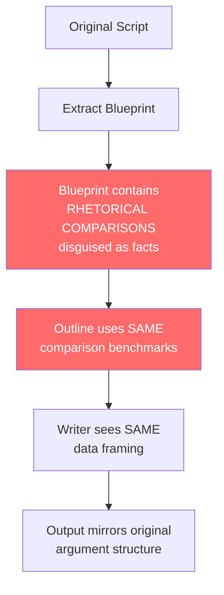

# Phân Tích So Sánh: Kịch Bản Gốc vs Viết Lại (Top 10 Shotguns)

## Kết Luận Tổng Thể

> [!CAUTION]
> Hệ thống kiểm duyệt **đánh dấu đỏ đúng**. Bản viết lại bám sát kịch bản gốc ở 3 tầng: (1) nguyên liệu tu từ, (2) cấu trúc lập luận, (3) mạch cảm xúc — dù đã đổi thứ tự, framework, và ngôn ngữ. Đây là vấn đề **cấu trúc pipeline** chứ không phải lỗi prompt đơn lẻ.

---

## Phân Tích Chi Tiết Từng Vấn Đề

### 🔴 Vấn đề 1: "Vay mượn" phép so sánh tu từ (Rhetorical Borrowing)

Đây là vấn đề nghiêm trọng nhất. So sánh tu từ là **fingerprint sáng tạo** của tác giả — copy nó = copy giọng văn.

| Product | Gốc (EN) | Viết lại (ES) | Vấn đề |
|---------|----------|---------------|--------|
| **DP-12** | "shorter than a standard Benelli M4 with the stock collapsed while carrying 16 rounds" | "Es más corta que una Benelli M4 con la culata colapsada, pero con el doble de munición" | **Copy y nguyên phép so sánh**: DP-12 vs M4 collapsed + 16 rounds. Đây là rhetorical benchmark CỦA tác giả gốc, không phải spec sheet data |
| **1301 vs M4** | "The M4 is built for long military service... The 1301 is built for the first 100 rounds to happen faster" | "Es el coche de Fórmula 1 frente al tanque de guerra" | Ít nhất đây là analogy MỚI, nhưng binary framing (speed vs durability) vẫn copy từ gốc |
| **M4** | "The heart of the gun is the Argo system. Two short self-cleaning gas pistons mounted just ahead of the chamber, not hanging out at the muzzle end" | "utiliza dos pistones de carrera corta, autolimpiables, montados justo delante de la recámara" | Paraphrase rất sát — giữ nguyên cấu trúc "two pistons + self-cleaning + placement detail" theo đúng thứ tự |

**Tại sao pipeline KHÔNG ngăn được?**

Writer prompt Rule #12 nói: `"Write as if you ONLY have the raw specs and have NEVER read the original script."` — Nhưng rule này chỉ là lời dặn dò, **không có cơ chế enforcement**. AI vẫn "nhớ" kịch bản gốc qua 2 đường:

1. **Blueprint chứa `detailed_facts` rất chi tiết** — extract prompt bảo "include EVERYTHING" → các phép so sánh tu từ bị extract như thể chúng là facts
2. **AI "nhớ" từ training data** — video phổ biến, AI có thể đã thấy transcript này trong training

---

### 🔴 Vấn đề 2: Cấu trúc lập luận trùng lặp (Argument Structure Mirroring)

| Product | Gốc | Viết lại | Trùng ở đâu |
|---------|-----|----------|-------------|
| **Saiga-12** | Speed breakthrough → Russian made → Sanctions 2014 → Range toy vs combat tool → Still relevant for drone defense | Fiabilidad heredada → Russian AK DNA → Sanctions 2014 → Collector's piece → Drone defense relevance | **Cùng narrative arc**: military tool → sanctions freeze → collector status → drone defense revival. Đây là STORYLINE của tác giả gốc |
| **VR80** | AR DNA not AK → 3-Gun competition star → "Built its reputation the right way. Not through style, through repeatability" → But real combat? | AR ergonomics → 3-Gun competition star → "Su reputación se forjó en el polígono, no en una trinchera" → Durability doubt | **Cùng argument pivot**: competition success → BUT real combat doubt. Câu "polígono vs trinchera" là DỊCH của "range vs trench" |
| **TS12** | Engineering marvel → 28" package with 16 rounds → BUT manual of arms demands training → Tube rotation punishes lazy hands | Engineering marvel → 28" with 16 rounds → BUT manual de armas ajeno → Tube rotation difícil bajo estrés | **Cùng weakness framing**: innovation → BUT training cost → tube rotation as punishment |

**Tại sao pipeline KHÔNG ngăn được?**

Outline prompt Rule #8 nói: `"CREATE YOUR OWN RANKING. Do NOT copy the original script's ranking."` — Framework đã thay đổi ranking (DP-12 xuống #8, Saiga lên #5), nhưng **argument structure PER PRODUCT** không bị kiểm soát. Outline chỉ kiểm soát:
- Thứ tự sản phẩm ✅ (đã đổi)
- Framework ✅ (đổi sang Tier List)
- Primary criterion per chapter ✅ (có vary)

Nhưng KHÔNG kiểm soát:
- ❌ Narrative argument flow trong mỗi chapter
- ❌ Which comparison benchmarks to use
- ❌ Which historical events to frame the story

---

### 🔴 Vấn đề 3: Mạch cảm xúc trùng (Emotional Arc Mirroring)

| Product | Emotional arc (Gốc) | Emotional arc (Viết lại) |
|---------|---------------------|--------------------------|
| **Saiga** | Respect → Disappointment (sanctions) → Nostalgia | Respect → Historical weight → Loss (sanctions) → Nostalgia |
| **VR80** | Familiar comfort → Competition pride → Reality check | Familiar comfort → Competition pride → Durability doubt |
| **TS12** | Engineering awe → Compactness shock → Training warning | Engineering marvel → Capacity wonder → Complexity warning |
| **M4** | Military adoption → ARGO explanation → Durability proof → 25 years → Legacy | Military adoption → ARGO explanation → Durability proof → 25 years → Legacy |

M4 chapter gần như **carbon copy emotional arc**. Cả hai đều:
1. Open with USMC adoption 1999
2. Explain ARGO system as "the heart"
3. Contrast with 1301 on speed vs durability
4. Close with "25 years and still the benchmark"

---

## Root Cause Analysis: Tại Sao Pipeline Thất Bại



### Nguyên nhân gốc: Extract Blueprint KHÔNG phân biệt FACT vs RHETORIC

`system_extract_blueprint_firearms.txt` line 32:
```
detailed_facts: A list of ALL individual factual data points...
Include EVERYTHING: specs, features, history, service status, test results,
design details, procurement data, known issues, unique features.
If the script mentions it, it MUST appear here.
```

> [!CAUTION]
> **"If the script mentions it, it MUST appear here"** — Rule này **đảm bảo** rằng rhetorical comparisons (DP-12 vs M4 collapsed), argumentative pivots (sanctions → collector), và emotional framings (polígono vs trinchera) đều bị extract vào blueprint dưới dạng "facts". Writer sau đó sử dụng blueprint → tái tạo cùng argument.

---

## Đề Xuất Fix — 3 Tầng

### Tầng 1: Extract Blueprint — Phân Biệt Fact vs Rhetoric (Critical)

Thêm instruction vào `system_extract_blueprint_firearms.txt`:

```
CRITICAL DISTINCTION — FACT vs AUTHOR OPINION:
- FACT: "DP-12 weighs 9 lbs 12 oz, has 16-round capacity, 29.5" OAL" ← KEEP
- AUTHOR RHETORIC: "shorter than a Benelli M4 with stock collapsed" ← DROP
- FACT: "Sanctions stopped imports in 2014" ← KEEP  
- AUTHOR NARRATIVE: "Sanctions froze it in time, turned it into a collector item" ← DROP

RULE: In `detailed_facts`, include ONLY verifiable specifications and 
historical facts. Do NOT include the author's:
- Comparative metaphors or rhetorical benchmarks
- Argumentative conclusions or narrative arcs
- Emotional framings or storytelling constructs
- Subjective product positioning or brand characterizations

Each fact must be independently verifiable from manufacturer specs, 
adoption records, or regulatory databases.
```

### Tầng 2: Outline Prompt — Force Original Argument (Medium)

Thêm instruction vào `system_review_outline_firearms.txt`:

```
ORIGINAL ARGUMENT STRUCTURE: For each body chapter, the `ranking_reason`
and `unique_selling_point` must present an ORIGINAL analytical angle.
Do NOT mirror the original script's argumentative framing:
- Choose DIFFERENT comparison benchmarks than the original 
- Frame weaknesses through a DIFFERENT lens
- If the original used a historical event as a narrative pivot,
  use a DIFFERENT structural approach (e.g., spec-first, user-scenario)
```

### Tầng 3: Writer Prompt — Anti-Mirroring Rule (Supporting)

Strengthen Rule #12 trong `system_write_review_firearms.txt`:

```
12. ORIGINALITY (STRICT): Write as if you ONLY have raw specs and have
NEVER read the original script. Specifically:
- Do NOT use the same comparison benchmark as the blueprint's 
  `comparisons` field (e.g., if blueprint says "shorter than Benelli M4",
  do NOT compare to Benelli M4 on size — find a different reference)
- Do NOT replicate the same argument flow: if blueprint shows 
  "military origin → sanctions → collector status", your chapter
  must use a COMPLETELY different narrative structure
- Create your OWN rhetorical analogies from raw spec data
```

---

## Specific Examples — What Should Change

### DP-12 (Before vs After Fix)

**Before (copied framing):**
> "Es más corta que una Benelli M4 con la culata colapsada, pero con el doble de munición."

**After (original framing from raw specs):**
> "29.5 pulgadas de longitud total. Para poner eso en perspectiva: es más corta que la mayoría de escopetas de corredera estándar, pero alberga 16 cartuchos. Eso es cuatro veces la capacidad de un Remington 870 en un paquete más compacto."

→ Usa un benchmark DIFERENTE (Remington 870 en vez de M4) y reframe DIFERENTE (multiplicador de capacidad en vez de comparación binaria)

### Saiga-12 (Before vs After Fix)

**Before (copied narrative arc):**
> "Las sanciones de 2014 detuvieron en seco las importaciones... transformándola de un caballo de batalla asequible en una pieza de coleccionista."

**After (original narrative arc from raw specs):**
> "Su sistema de gas de dos posiciones requiere ajustes cuidadosos según la munición. No es una herramienta para el tirador casual. Pero para quien entiende la plataforma AK y está dispuesto a invertir tiempo en configuración, la recompensa es un nivel de velocidad de recarga que los tubos simplemente no pueden igualar."

→ Restructures entirely: leads with USER EXPERIENCE instead of HISTORICAL NARRATIVE. Sanctions mentioned as fact, not as storyline pivot.

---

## Resumen de Acciones

| Prioridad | Acción | Archivo | Impacto |
|-----------|--------|---------|---------|
| 🔴 Critical | Separar fact vs rhetoric en extract | `system_extract_blueprint_firearms.txt` | Elimina la fuente de contaminación |
| 🟡 Medium | Force original argument angles | `system_review_outline_firearms.txt` | Impide que outline replique narrative arcs |
| 🟡 Medium | Strengthen anti-mirroring rule | `system_write_review_firearms.txt` | Última línea de defensa |
