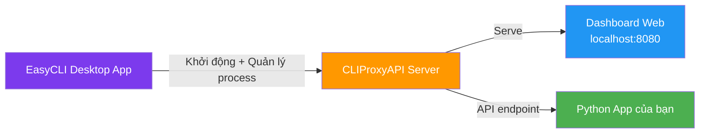

# Phân tích cuộc trò chuyện & So sánh EasyCLI vs Local Dashboard

## 1. Cuộc trò chuyện trong ảnh nói gì?

### Nội dung chính

Đây là cuộc thảo luận trong **cộng đồng Việt Nam** (có vẻ Discord/Telegram) về cách sử dụng Gemini CLI + CLIProxyAPI để "farm" (sử dụng nhiều tài khoản AI miễn phí):

| Ai nói | Nội dung chính |
|---|---|
| **Điệp Đi Đâuuu** | Chia sẻ link geminicli.com — bảo tải về, OAuth login, verify là xong |
| **Điệp (tiếp)** | Giải thích: Khi dùng acc domain + proxypal thì bị lỗi "chưa verify". Phải tải **Gemini CLI** về, login → Google gửi mã OTP qua SMS → verify xong mới dùng được. Sau đó add chạy "farm pro" |
| **gnanetads** | Hỏi: dùng acc domain với proxypal gọi gemini không được? Acc domain HK dùng Veo3 sống bao lâu? |
| **Ernesta** | Show screenshot **EasyCLI Control Panel** — add 4-5 tài khoản, chưa thấy con nào die, cả tháng rời |

### Quy trình họ mô tả

```
1. Tải Gemini CLI (npm install -g @google/gemini-cli)
2. Chạy gemini cli → login Google OAuth
3. Google gửi OTP qua SMS → verify
4. Tài khoản được verify → thêm vào CLIProxyAPI
5. Dùng EasyCLI hoặc dashboard web để quản lý nhiều tài khoản
6. Round-robin load balancing giữa các acc → "farm"
```

> [!IMPORTANT]
> **Bước verify**: Gemini CLI yêu cầu verify tài khoản Google qua SMS/OTP trước khi có thể sử dụng API. Nếu chỉ dùng "acc domain" mà chưa verify qua Gemini CLI → sẽ bị lỗi khi gọi API qua proxy.

---

## 2. EasyCLI là gì?

**EasyCLI** = **Desktop GUI app** (Tauri v2) để quản lý CLIProxyAPI.

Đây chính là app trong screenshot của "Ernesta" — cái cửa sổ "EasyCLI Control Panel".

### Tính năng EasyCLI

| Tab | Chức năng |
|---|---|
| **Basic Setting** | Port, debug, proxy URL, remote management, start at login |
| **Access Token** | Quản lý API access token |
| **Authentication Files** | Upload/download/delete JSON auth files (file chứa thông tin đăng nhập Gemini/Claude/etc.) |
| **Third Party API Keys** | Quản lý API key Gemini, Codex, Claude Code |
| **OpenAI Compatibility** | Cấu hình providers (base URL, API key, model aliases) |

### Đặc điểm kỹ thuật
- **Framework**: Tauri v2 (Rust backend + HTML/CSS/JS frontend)
- **Modes**: Local mode + Remote mode
- **System tray**: Chạy nền, ẩn vào tray khi đóng
- **Auto-update**: Tự tải CLIProxyAPI bản mới nhất
- **Auth callback**: Tích hợp OAuth flow cho Gemini (port 8085), Claude (54545), Codex (1455)

---

## 3. So sánh: EasyCLI vs Local Dashboard (127.0.0.1:8080/dashboard.html)

| Tiêu chí | EasyCLI | Dashboard Web (localhost:8080) |
|---|---|---|
| **Loại app** | Desktop app (Tauri/Rust) | Web page tĩnh, serve bởi CLIProxyAPI |
| **Cài đặt** | Phải tải installer riêng | Có sẵn khi chạy CLIProxyAPI |
| **System tray** | ✅ Chạy nền, ẩn vào tray | ❌ Chỉ mở trên browser |
| **Auto-update CLIProxyAPI** | ✅ Tự tải bản mới | ❌ Phải tự cập nhật |
| **OAuth flow** | ✅ Tích hợp callback server | ❌ Phải login CLI thủ công |
| **Quản lý account** | ✅ Upload/download auth file qua GUI | ✅ Qua Management API |
| **Settings** | ✅ GUI trực quan | ✅ Cũng có giao diện web |
| **Start at login** | ✅ | ❌ (phải tự tạo shortcut) |
| **Remote management** | ✅ Hỗ trợ | ✅ Qua API endpoint |
| **Custom mở rộng** | ❌ Khó (Tauri/Rust) | ✅ Dễ sửa HTML/JS |
| **Phụ thuộc** | Cần cài app riêng | Không cần cài thêm gì |

---

## 4. Nên dùng cái nào?

### 👉 Khuyến nghị: **Dùng cả hai, mỗi cái có vai trò riêng**

#### Dùng EasyCLI khi:
- ✅ Muốn **tự động start CLIProxyAPI** khi bật máy
- ✅ Cần **OAuth flow** tiện lợi (add account mới nhanh)
- ✅ Muốn **auto-update** CLIProxyAPI
- ✅ Muốn app chạy **nền ở system tray**

#### Dùng Dashboard web (localhost:8080) khi:
- ✅ Muốn **xem status** nhanh của các tài khoản
- ✅ Muốn **custom** thêm tính năng riêng (vì bạn đã xây dựng web quản lý riêng)
- ✅ Muốn **tích hợp** monitoring vào workflow Python hiện tại của bạn

### Kịch bản tốt nhất



> [!TIP]
> **Cách dùng tối ưu**: Dùng **EasyCLI** để khởi động và quản lý CLIProxyAPI process (chạy nền, auto-start). Dùng **Dashboard web** để monitor status và tích hợp vào workflow của bạn. Hai cái không xung đột — EasyCLI quản lý "engine", Dashboard web quản lý "data/status".

---

## 5. Lưu ý quan trọng từ cuộc trò chuyện

> [!CAUTION]
> - Account **chưa verify** qua Gemini CLI sẽ **không hoạt động** dù đã add vào CLIProxyAPI
> - Cần verify bằng **SMS/OTP** khi login Gemini CLI lần đầu
> - Account domain HK (Hong Kong) có thể bị hạn chế hoặc die nhanh hơn
> - Ernesta báo chạy 4-5 account, cả tháng chưa die → cho thấy hệ thống khá ổn định nếu verify đúng
