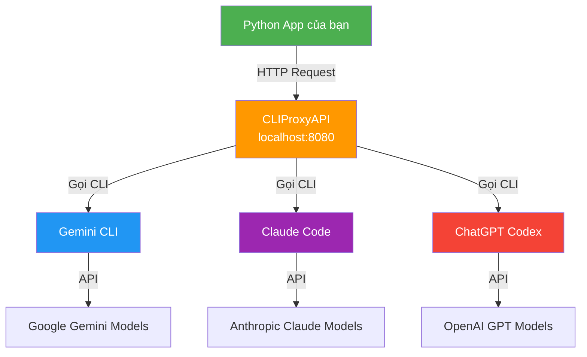

# Gemini CLI vs CLIProxyAPI — So sánh nghiên cứu

## 1. Gemini CLI là gì?

**Gemini CLI** là công cụ AI coding **chính thức của Google**, chạy trực tiếp trong terminal.

- **Cài đặt**: `npm install -g @google/gemini-cli`
- **Mô hình**: Sử dụng Gemini 3 (và các model Gemini khác)
- **GitHub chính thức**: [google-gemini/gemini-cli](https://github.com/google-gemini/gemini-cli)

### Tính năng chính
| Tính năng | Mô tả |
|---|---|
| **File management** | Đọc, sửa, tạo file trực tiếp |
| **Shell commands** | Chạy lệnh hệ thống |
| **Agent Skills** | Agent chuyên biệt cho task cụ thể |
| **MCP Servers** | Kết nối MCP server bên ngoài |
| **Extensions** | Mở rộng khả năng bằng plugin |
| **Headless mode** | Chạy không cần UI (dùng flag `-p`) — phù hợp scripting/automation |
| **Subagents** | Sử dụng agent phụ cho task song song |
| **Checkpointing** | Lưu snapshot session tự động |
| **Sandboxing** | Cách ly tool execution |

### Pricing (Free tier)
| Auth method | Quota miễn phí |
|---|---|
| Google login | 1000 requests/ngày, 60/phút |
| Gemini API Key (free) | 250 requests/ngày, 10/phút (chỉ Flash model) |
| Vertex AI Express | 90 ngày miễn phí |

---

## 2. CLIProxyAPI là gì?

**CLIProxyAPI** là một **proxy server bên thứ 3** (không phải của Google). Nó **wrap (bọc)** nhiều CLI tool khác nhau và expose ra API endpoints tương thích OpenAI/Gemini/Claude.

### Cơ chế hoạt động

```
[App của bạn] → HTTP Request → [CLIProxyAPI proxy] → [Gemini CLI / Claude Code / Codex / etc.] → [AI Model]
```

### Tính năng chính
| Tính năng | Mô tả |
|---|---|
| **OpenAI-compatible API** | Expose endpoint giống OpenAI API (`/v1/chat/completions`) |
| **Multi-provider** | Hỗ trợ Gemini CLI, Claude Code, ChatGPT Codex, Qwen Code, iFlow |
| **Multi-account** | Round-robin load balancing nhiều tài khoản |
| **Streaming** | Hỗ trợ cả streaming và non-streaming |
| **Function calling** | Hỗ trợ tool/function calls |
| **Multimodal** | Hỗ trợ text + images |
| **Management API** | API quản lý tài khoản, status |
| **Dashboard** | Giao diện web quản lý (ở `localhost:8080`) |

---

## 3. So sánh trực tiếp

| Tiêu chí | Gemini CLI | CLIProxyAPI |
|---|---|---|
| **Ai phát triển** | Google (chính thức) | Cộng đồng (bên thứ 3) |
| **Bản chất** | CLI tool tương tác AI | Proxy server wrap CLI tools |
| **Input/Output** | Terminal trực tiếp hoặc headless mode | HTTP API (OpenAI-compatible) |
| **Model** | Gemini models | Gemini + Claude + GPT + Qwen + iFlow |
| **Mục đích** | Coding trực tiếp trong terminal | Cung cấp API endpoint để app khác gọi |
| **Cần proxy không?** | Không | Chính nó LÀ proxy |
| **Multi-account** | Không hỗ trợ native | Có, round-robin load balancing |
| **Dashboard** | Không | Có (web UI quản lý) |

---

## 4. Mối quan hệ với hệ thống hiện tại của bạn

Dựa trên mô tả của bạn:

```
[Tool của bạn (Python app)] 
    → HTTP API call 
    → [CLIProxyAPI (localhost:8080)] 
    → [Gemini CLI chạy ngầm bên dưới] 
    → [Gemini AI model]
```

> [!IMPORTANT]
> **Gemini CLI là "engine" bên dưới**, còn **CLIProxyAPI là "lớp proxy"** giữa app Python của bạn và Gemini CLI. Chúng **KHÔNG giống nhau** — CLIProxyAPI **sử dụng** Gemini CLI (và các CLI khác) như một backend.

### Tại sao cần CLIProxyAPI?
- Gemini CLI **không có HTTP API endpoint** — nó chỉ là CLI tool chạy trong terminal
- CLIProxyAPI **bọc** Gemini CLI lại, biến nó thành REST API tương thích OpenAI
- Nhờ vậy, app Python của bạn có thể gọi AI qua HTTP requests bình thường (giống gọi OpenAI API)

### Dashboard hiện tại (`http://127.0.0.1:8080/dashboard.html`)
Đây là dashboard web của CLIProxyAPI, cho phép:
- Quản lý tài khoản Gemini/Claude/etc.
- Xem trạng thái các tài khoản
- Load balancing giữa nhiều tài khoản
- Theo dõi usage

---

## 5. Tóm tắt



**Kết luận**: Gemini CLI (geminicli.com) là công cụ chính thức của Google. CLIProxyAPI là proxy bên thứ 3 "bọc" Gemini CLI (và nhiều CLI khác) thành API. Trong hệ thống của bạn, CLIProxyAPI đóng vai trò **middleware/gateway** giữa app Python và các AI models.
