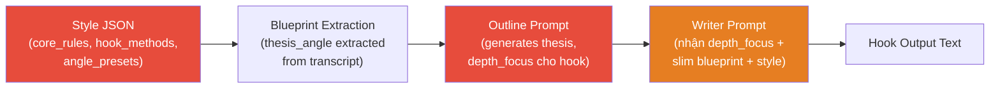

# Fix: Hook luôn mở bằng "mentira / lời nói dối"

## Full Pipeline Trace



## Root Cause Analysis — 5 nguồn gốc xuyên suốt 3 tầng

### Tầng 1: Style JSON — giọng "contrarian" thấm vào DNA

| Vị trí | Nội dung gây lặp | Ảnh hưởng |
|--------|-------------------|-----------|
| `core_rules.identity` (line 48) | "cut through noise", "**challenging popular assumptions**", "**exposing overlooked value**" | Thiết lập persona MẶC ĐỊNH là người vạch trần |
| `core_rules.tone` (line 49) | "**contrarian edge**" | AI hiểu cần phải chống lại consensus |
| `angle_presets.myth_busting.thesis_direction` (line 203) | "**Debunking** common beliefs — **what everyone gets wrong**" | Angle chỉ dẫn "mọi người sai" |
| `angle_presets.contrarian_underrated.thesis_direction` (line 278) | "data proves **the market is wrong**" | Cùng hướng "sai lầm" |
| `angle_presets.contrarian_underrated.thesis_examples` (line 298) | "**The market is wrong** about this one" | Copy trực tiếp |

> [!CAUTION]
> **Gốc rễ thực sự**: Không phải 1 dòng prompt gây vấn đề — mà là **TOÀN BỘ hệ thống** (identity + tone + angle) đều hướng AI theo cùng 1 tư duy: "vạch trần sai lầm". AI sẽ LUÔN mở hook bằng "lie/deception" vì đó là interpretation tự nhiên nhất của toàn bộ style guide.

### Tầng 2: Outline Prompt — ví dụ GOOD làm template

| Vị trí | Nội dung | Ảnh hưởng |
|--------|----------|-----------|
| Line 28 | `GOOD depth_focus: "The market sells a $2,000 illusion"` | AI outline copy pattern "illusion/market lie" vào mọi depth_focus |

**Bằng chứng** — 5/5 outline outputs có depth_focus theo pattern "deception":
- "El mercado **vende la ilusión** de que se necesita un rifle de $2,000"
- "La **falsa premisa** de que más potencia siempre equivale a mayor seguridad"
- "El mercado **vende la ilusión** de que el calibre 12 es intocable"

### Tầng 3: Writer Prompt — framework focus dùng ngôn ngữ "wrong"

| Vị trí | Nội dung | Ảnh hưởng |
|--------|----------|-----------|
| Line 81 | Ranking: "why the conventional ranking wisdom is **wrong**" | → AI viết "te han mentido" |
| Line 82 | Catalog: "viewer's current knowledge is **incomplete**" | → AI viết "no sabes la verdad" |
| Line 84 | Deep Dive: "what the consensus **gets wrong**" | → AI viết "te vendieron una ilusión" |

### Tầng 4: hook_methods — 3/3 đều aggressive

| Method | Description |
|--------|-------------|
| `damning_verdict_first` | "shocking verdict that **breaks consensus**" |
| `stress_test_cold_open` | "violent, visceral stress test" |
| `provocative_caliber_question` | "most **divisive** gun community **debates**" |

→ Không có method nào cho phép hook mở bằng scenario, story, hay so sánh trung tính.

### Tầng 5: Blueprint thesis_angle — đã bị "nhiễm" từ extraction

Thesis_angle do `system_extract_blueprint_firearms_v2.txt` trích từ transcript. Nhưng nó cũng theo pattern contrarian:
- "Te han **mentido** sobre el .22 long rifle"
- "La industria moderna ha pasado 40 años **enterrando** el cartucho más eficiente"

Outline nhận thesis_angle + GOOD example "illusion" → kết hợp lại → tạo depth_focus "lie"

---

## Proposed Changes

> [!IMPORTANT]
> Cần sửa **ở cả 3 tầng** — chỉ sửa 1 tầng sẽ không giải quyết triệt để vì các tầng khác vẫn đẩy AI về cùng pattern.

### Tầng 1: Style JSON — đa dạng hóa identity + bỏ "contrarian" default

#### [MODIFY] [Review_firearms_v2.json](file:///f:/1.%20Edit%20Videos/8.AntiCode/2.Script_Split_Chapter/styles/Review_firearms_v2.json)

**core_rules.identity (line 48)**: Bỏ "challenging popular assumptions" — thay bằng ngôn ngữ trung tính:

```diff
-"identity": "...exposing overlooked value, challenging popular assumptions, or revealing what the data actually shows..."
+"identity": "...highlighting overlooked value, presenting unexpected data, or reframing what the numbers actually mean..."
```

**core_rules.tone (line 49)**: Bỏ "contrarian edge":

```diff
-"tone": "Base register: authoritative and conversational with a contrarian edge."
+"tone": "Base register: authoritative and conversational. The tone adapts to the data — confrontational when data demands it, exploratory when data surprises, matter-of-fact when data speaks for itself."
```

**angle_presets**: Sửa thesis_direction của `myth_busting` và `contrarian_underrated`:

```diff
 "myth_busting": {
-  "thesis_direction": "Debunking common beliefs with hard data — what everyone gets wrong",
+  "thesis_direction": "Testing popular beliefs against hard data — separating fact from assumption",

 "contrarian_underrated": {
-  "thesis_direction": "Going against the mainstream — data proves the market is wrong",
+  "thesis_direction": "Surfacing overlooked options — data reveals value the market underestimates",
```

---

### Tầng 2: Outline Prompt — thay example + thêm diversity rule

#### [MODIFY] [system_review_outline_firearms_v2.txt](file:///f:/1.%20Edit%20Videos/8.AntiCode/2.Script_Split_Chapter/prompts/system_review_outline_firearms_v2.txt)

**Line 26-28**: Thay GOOD example, thêm BANNED pattern, thêm diversity list:

```diff
- depth_focus for hook must be a PROVOCATIVE ANGLE or THESIS...
-   BAD depth_focus:  "The difference between direct blowback and delayed systems"
-   GOOD depth_focus: "The market sells a $2,000 illusion..."
+ depth_focus for hook must be a COMPELLING ANGLE — never a technical explanation.
+   BAD: "The difference between direct blowback and delayed systems" (technical lecture)
+   BAD: "The market sells a lie/illusion" (overused deception framing — BANNED)
+   BAD: Any depth_focus starting with "The market/industry has lied/sold/deceived"
+   
+   GOOD examples (use as INSPIRATION, never copy):
+   - "One $400 entry outperforms three guns at triple the price — and the reason has nothing to do with specs"
+   - "The gun that every forum dismisses sits at the top of one critical metric"
+   - "At 3 AM in a narrow hallway, the spec sheet advantage disappears — something else decides the outcome"
+   
+   VARIETY RULE: Each video must use a DIFFERENT hook angle. Choose from:
+   - Surprising data point (a number that contradicts expectations)
+   - Real-world scenario (a situation where the topic matters)
+   - Unexpected comparison (two products/concepts nobody expected to compete)
+   - Bold question (a question that divides the community)
+   - Historical context (a backstory that changes perception)
```

---

### Tầng 3: Writer Prompt — bỏ ngôn ngữ "wrong", thêm VARIETY RULE

#### [MODIFY] [system_write_review_firearms_v2.txt](file:///f:/1.%20Edit%20Videos/8.AntiCode/2.Script_Split_Chapter/prompts/system_write_review_firearms_v2.txt)

**Line 80-84**: Framework-specific focus — bỏ "wrong/incomplete/gets wrong":

```diff
 FRAMEWORK-SPECIFIC HOOK FOCUS:
-- Ranking: Tease the surprising winner/loser and why the conventional ranking wisdom is wrong.
-- Catalog: Establish the category's relevance and why the viewer's current knowledge is incomplete.
-- Head-to-Head: Frame the central matchup tension — why this comparison matters and what's at stake.
-- Deep Dive: Establish what the consensus gets wrong about this single product/topic.
+- Ranking: Create tension around which product earns which position — and why the order will surprise.
+- Catalog: Show why this category matters right now and what most buyers overlook.
+- Head-to-Head: Set up the central matchup — what each side brings and why the outcome isn't obvious.
+- Deep Dive: Reveal the one thing about this product that changes how you evaluate it.
```

**Thêm VARIETY RULE** (sau line 84):
```
VARIETY RULE (MANDATORY):
  Do NOT open with "you've been lied to", "they sold you a lie/illusion", or any deception framing.
  The hook MUST match the depth_focus from the outline — do NOT override it with a lie-pattern.
  Available opening approaches: scenario, question, contrast, bold claim, story, data surprise.
```

---

### Tầng 4: hook_methods — thêm 2 methods trung tính

#### [MODIFY] [Review_firearms_v2.json](file:///f:/1.%20Edit%20Videos/8.AntiCode/2.Script_Split_Chapter/styles/Review_firearms_v2.json)

**Line 112-136**: Thêm methods mới giữa `provocative_caliber_question` và `hook_writing_rules`:

```json
"scenario_cold_open": {
  "description": "Drop the viewer into a vivid, specific real-world moment where the topic matters.",
  "structure": "Vivid scenario (2-3 sentences) → Why this moment matters → What we're about to discover",
  "rule": "Scenario must use real-world context from blueprint (practical_use_case or reliability data)."
},
"data_surprise_opener": {
  "description": "Lead with a single counter-intuitive number or comparison that reframes the entire topic.",
  "structure": "Surprising data point → Why it contradicts expectations → Set up the analysis",
  "rule": "Number must come directly from blueprint data. No invented stats."
}
```

**Thêm vào `hook_writing_rules.banned_patterns`**:
```json
"The market/industry has lied/sold you a lie",
"You've been deceived/misled",
"Everything you think you know is wrong",
"Te han mentido / te vendieron una mentira"
```

## Open Questions

> [!IMPORTANT]
> 1. Bạn có muốn giữ lại `core_rules.identity` phần "challenging popular assumptions" cho body chapters không? Hay bỏ hoàn toàn khỏi DNA?
> 2. Về `angle_presets.thesis_examples` — các ví dụ như "The market is wrong about this one" có nên xóa luôn không?

## Verification Plan

### Manual Verification
- Chạy lại 2-3 video đã test (AR-9, Revolvers, 20 vs 12 Gauge)
- Kiểm tra:
  - `_review_outline.json` → depth_focus có còn chứa "illusion/lie/mentira" không
  - `ch_01_Intro.txt` → câu mở đầu có đa dạng không
- So sánh trước/sau bằng table
