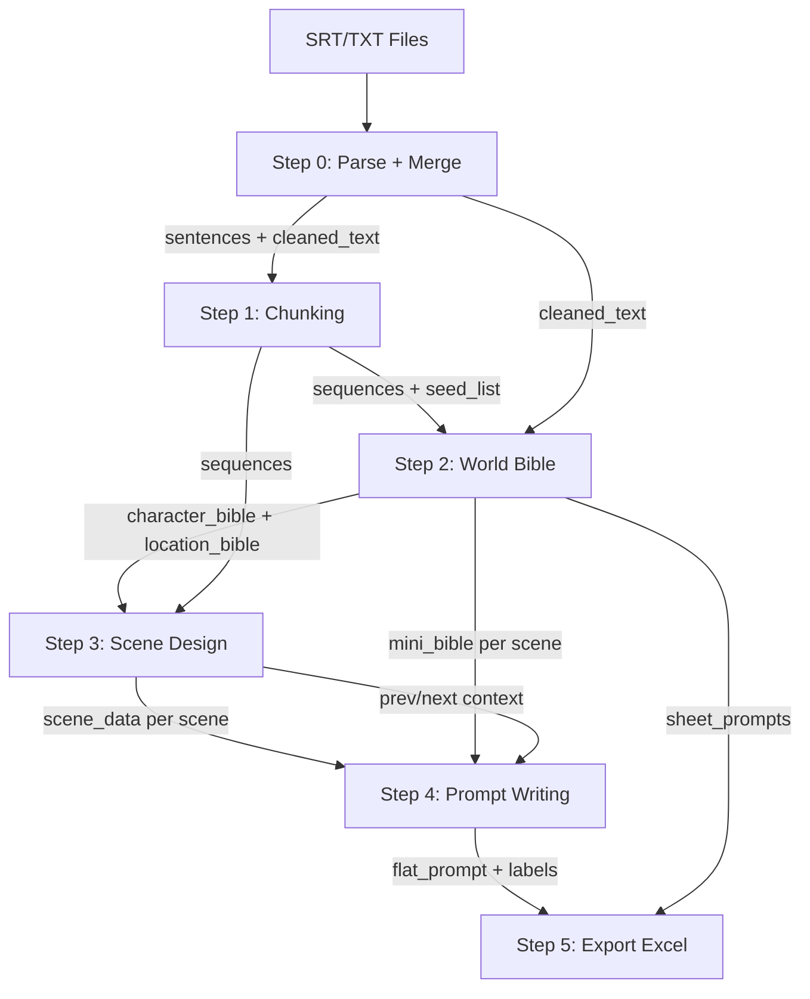

# Video Pipeline Redesign v2 — Data Flow & Context Strategy

## Pipeline Overview (5 steps)

```
Step 0: Parse + Merge        [Python]     → sentences
Step 1: Semantic Chunking    [LLM×1]      → sequences
Step 2: World Bible          [LLM×2]      → characters + factions + locations
Step 3: Scene Design         [LLM×batch]  → scenes (timing, camera, action, costume)
Step 4: Prompt Writing       [LLM×scene]  → flat_prompt (1 call = 1 scene)
Step 5: Export               [Python]     → Excel
```

---

## Data Flow Diagram



---

## Step 0: Parse + Merge [Python]

**Input:** List of file paths (1 file or N chapter files)
**Output:** `sentences[]`, `cleaned_text`

```python
# Multi-file merge: offset timing so all chapters form continuous timeline
# Chapter 1: 0s → 49s
# Chapter 2: 49s → 97s  (offset += chapter1_end)
# Chapter 3: 97s → 154s (offset += chapter2_end)

sentence = {
    "sentence_id": 1,        # Global sequential ID
    "chapter_id": 1,
    "chapter_name": "The Numb Arm and Childhood Signs",
    "text": "You are nine years old...",
    "start_time": 0.5,        # Offset-adjusted
    "end_time": 3.2,
    "duration": 2.7
}
```

---

## Step 1: Semantic Chunking [LLM, 1 call]

**No change** from current logic. Nhận merged sentences → output sequences.

**Thêm:** Sequences giữ `chapter_id`:
```json
{
    "sequence_id": "SEQ_01",
    "chapter_id": 1,
    "sentence_ids": [1, 2, 3],
    "main_subject": "Prince Baldwin",
    "location_shift": "Palace courtyard",
    "full_text": "...",
    "total_duration": 16.5
}
```

**Seed list** cho Step 2:
```python
seed_subjects = set(seq["main_subject"] for seq in sequences)
seed_locations = set(seq["location_shift"] for seq in sequences)
# → {"Prince Baldwin", "Saladin", "The Tutor", ...}
# → {"Palace courtyard", "Montgisard battlefield", ...}
```

---

## Step 2: World Bible [LLM Pro, 2 calls]

### Step 2a: Characters + Factions

**System prompt:** `STEP2_CHARACTERS_SYSTEM_PROMPT` + `STYLE SUMMARY`

**User message:**
```
=== SEED LIST (from script analysis) ===
Detected subjects: Prince Baldwin, Saladin, The Tutor, Reynald, ...
Detected locations: Palace courtyard, Montgisard, Jerusalem throne room, ...
=== END SEED LIST ===

=== FULL SCRIPT ===
Chapter 1: The Numb Arm and Childhood Signs
You are nine years old. Your arm doesn't feel the fire...

Chapter 2: The Final Verdict of Leprosy
The physician pulls your father aside...

[...all 11 chapters...]
=== END SCRIPT ===

Analyze ALL characters across the ENTIRE story.
For PROTAGONIST characters that appear across multiple life stages,
create separate entries: Child, Teen, Adult, Elder.
```

**Output:**
```json
{
  "characters": [
    {
      "label": "Jerusalem-King-A-Child",
      "real_name": "Baldwin IV",
      "group": "PROTAGONIST",
      "age_stage": "child",
      "age_chapters": [1, 2],
      "visual_description": "Compact 3-heads-tall child body...",
      "default_costume": "Simple noble youth's linen tunic with leather belt",
      "sheet_prompt": "Character reference sheet. Three neutral standing views: 
                       front, 3/4 angle, side profile. Clean white background. ..."
    },
    {
      "label": "Jerusalem-King-A-Teen",
      "real_name": "Baldwin IV",
      "group": "PROTAGONIST",
      "age_stage": "teen",
      "age_chapters": [3, 4, 5],
      "visual_description": "~3.5 heads tall teenage body...",
      "default_costume": "Crusader surcoat with Jerusalem cross over chainmail",
      "sheet_prompt": "..."
    }
  ],
  "factions": [...]
}
```

### Step 2b: Locations

Giữ nguyên, nhưng thêm `location_style` (background-only, KHÔNG có character descriptions).

---

## Step 3: Scene Design [LLM, batched]

**Mục đích:** Chia sequences thành scenes, xác định camera + timing + action + **costume**.
Không viết flat_prompt — chỉ output structured data.

**System prompt:** Scene Director rules (camera, timing, etc.)

**User message per batch:**
```
=== CHARACTER LABELS (for reference only) ===
PROTAGONIST: Jerusalem-King-A-Child (Ch1-2), Jerusalem-King-A-Teen (Ch3-5), 
             Jerusalem-King-A-Adult (Ch6-8), Jerusalem-King-A-Elder (Ch9-11)
NAMED: Ayyubid-Sultan-A (Saladin), Crusader-Tutor-A (The Tutor)
FACTIONS: Noble-Boys, Crusader-Army, Ayyubid-Army
LOCATIONS: Palace-Courtyard, Palace-Interior, Jerusalem-Throne-Room, Montgisard-Battlefield
=== END LABELS ===

=== STYLE SUMMARY ===
[brief style summary for visual consistency]
=== END STYLE ===

=== SEQUENCES TO STORYBOARD ===
[batch of sequences with full_text, total_duration, chapter_id]
=== END SEQUENCES ===
```

**Output JSON per scene:**
```json
{
  "sequence_id": "SEQ_01",
  "scenes": [
    {
      "scene_id": "SEQ_01_SCN_01",
      "duration": 5.5,
      "shot_type": "Wide Shot",
      "camera_motion": "Slow Pan",
      "characters_used": ["Jerusalem-King-A-Child"],
      "factions_used": ["Noble-Boys"],
      "location_used": "Palace-Courtyard",
      "action_brief": "Young Baldwin pins a larger boy to the ground during wrestling",
      "costume_note": "Dirt-stained linen tunic, right forearm exposed with red scratches",
      "background_note": "Stone colonnades, dust clouds, other boys wrestling",
      "lighting": "Bright Middle Eastern sunlight, sharp shadows under colonnades",
      "mood": "Intense, competitive",
      "audio_sync": "You are nine years old. Your arm doesn't feel the fire."
    }
  ]
}
```

> [!NOTE]
> Step 3 chỉ output **structured data**. Step 4 sẽ dùng data này để viết prompt.
> `costume_note` là field mới — mô tả trang phục CỤ THỂ cho scene này (khác với default_costume trong character sheet).

---

## Step 4: Prompt Writing [LLM, 1 call per scene]

> [!IMPORTANT]
> **Đây là bước tạo prompt chất lượng cao.** Mỗi scene = 1 API call.
> Giống image pipeline (`prompt_generator.py`): LLM tập trung viết 1 prompt.

### System Prompt
= **Toàn bộ style file** (Role + Visual Strategy + Rules + flat_prompt rules)

Giống hệt image pipeline: style file = system prompt.

### User Message (per scene)

```
=== VISUAL REFERENCE ===
[Jerusalem-King-A-Child]: Compact 3-heads-tall child body, oversized round 
pure white face, oval dot eyes, brown hair blocks, simplified mitten hands. 
Default costume: simple noble youth's linen tunic.

[Noble-Boys]: Rows of identical 3-heads-tall boys in muted linen tunics, 
round white faces, dot eyes, no noses, mitten hands.

[Palace-Courtyard]: Sun-baked flagstone courtyard with shaded stone colonnades 
and elevated balconies. Wooden training gear scattered. 
Default lighting: bright direct sunlight with sharp contrasting shadows.
=== END REFERENCE ===

=== SCENE CONTEXT ===
PREVIOUS SCENE: Wide Shot — [Jerusalem-King-A-Child] and [Noble-Boys] 
wrestling aggressively in the courtyard, dust swirling.

>>> CURRENT SCENE <<<
  Chapter: 1 — The Numb Arm and Childhood Signs
  Duration: 5.5s
  Camera: Medium Shot
  Location: [Palace-Courtyard]
  Characters: [Jerusalem-King-A-Child]
  Action: A boy scrapes Baldwin's forearm hard, leaving vivid red scratches. 
          Baldwin doesn't flinch — zero reaction.
  Costume: Dirt-stained linen tunic, right forearm fully exposed, 
           three red scratch marks visible on pale skin.
  Background: Other Noble-Boys wrestling behind, dust swirling near ground.
  Lighting: Bright sunlight highlighting the red marks on pale skin.
  Mood: Ominous, unsettling — something is wrong.

NEXT SCENE: Medium Shot — [Crusader-Tutor-A] watches from balcony 
with horrified expression, gripping the stone railing.
=== END CONTEXT ===

Write a single flat_prompt paragraph for the CURRENT SCENE.
Rules:
- Use [Label] brackets for all characters, factions, locations
- Include the specific costume for this scene (NOT the default from reference)
- Weave camera, action, background, lighting into natural flowing prose
- Follow style rules in system prompt
- Do NOT include Mandatory Style or Negative Prompt (appended automatically)
```

### LLM Output (expected):
```
A stylized historical animation with thick dark outlines depicting a medium shot 
in [Palace-Courtyard]. A boy's mitten-shaped hand scrapes hard against 
[Jerusalem-King-A-Child]'s exposed right forearm, leaving three vivid red scratch 
marks on pale skin. Jerusalem-King-A-Child stands completely still in his 
dirt-stained linen tunic, his oversized round pure white face showing zero reaction — 
oval dot eyes unblinking, mouth a flat neutral line. Behind them, blurred forms of 
[Noble-Boys] in muted tunics grapple in swirling dust clouds near the sun-baked 
flagstones. Bright Middle Eastern sunlight highlights the red marks against his pale 
skin, casting sharp shadows under the stone colonnades. In the style of a professional 
historical animation. This is NOT photorealistic, NOT anime, NOT 3D CGI.
```

### Post-processing (Python):
```python
# Append suffix (giống image pipeline)
suffix = extract_style_suffix(style_content)
# → "Mandatory Style: ... Negative Prompt: ..."
final = f"{llm_output} {suffix}"
```

### Context Window Strategy:
```python
def _build_scene_context(scene_idx, all_scenes):
    prev = all_scenes[scene_idx - 1] if scene_idx > 0 else None
    next_ = all_scenes[scene_idx + 1] if scene_idx < len(all_scenes) - 1 else None
    
    # Build brief summary of prev/next for continuity
    prev_text = f"PREVIOUS: {prev['shot_type']} — {prev['action_brief']}" if prev else ""
    next_text = f"NEXT: {next_['shot_type']} — {next_['action_brief']}" if next_ else ""
    
    return prev_text, next_text
```

### Token Optimization — Mini Bible:
```python
def _build_mini_bible(scene, characters, factions, locations):
    """Only include characters/locations USED in this scene + neighbors."""
    needed_chars = set(scene["characters_used"])
    needed_facs = set(scene["factions_used"])
    needed_locs = {scene["location_used"]}
    
    # Add prev/next scene's characters/locations too
    if prev_scene:
        needed_chars |= set(prev_scene["characters_used"])
    if next_scene:
        needed_chars |= set(next_scene["characters_used"])
    
    # Filter full bible to only needed entries
    mini_chars = [c for c in characters if c["label"] in needed_chars]
    mini_facs = [f for f in factions if f["faction_name"] in needed_facs]
    mini_locs = [l for l in locations if l["label"] in needed_locs]
    
    return format_bible(mini_chars, mini_facs, mini_locs)
```

---

## Step 5: Export [Python only]

**Sheet 1: Video Prompts**

| # | Chapter | Scene ID | Duration | Shot | Characters | Location | Flat Prompt | Negative Prompt |
|---|---|---|---|---|---|---|---|---|

**Sheet 2: Reference Images**

| # | Type | Label | Prompt | Negative Prompt |
|---|---|---|---|---|

- **Character/Faction prompts:** `sheet_prompt` (full character style)
- **Location prompts:** `LOCATION STYLE` + description + "NO characters, NO people, empty scene"

---

## Style File Changes

Add to `Chibi Storybook Historical.txt`:
```
=== LOCATION STYLE ===
Stylized historical animation illustration, detailed painterly background, 
scene-driven natural palette, scene-driven lighting, professional animation quality, 
clean consistent design, full frame, no border, no text, no watermark, 16:9 aspect ratio.
```

---

## Summary: What Each Step Sends to LLM

| Step | System Prompt | User Message | Output |
|---|---|---|---|
| 1 | Chunking rules | All sentences | Sequences |
| 2a | Character analysis + Style Summary | Full script + Seed list | Characters + Factions |
| 2b | Location analysis | Full script + Seed locations | Locations |
| 3 | Scene Director rules | Character/Location LABELS + Style Summary + Sequence batch | Scene data (structured) |
| 4 | **Full style file** | Mini Bible + Scene data + Prev/Next context | **flat_prompt** (natural prose) |

## Verification Plan

1. Run on Baldwin IV (11 chapters)
2. Check: 1 Excel, consistent labels, age variants present
3. Check flat_prompt: natural flow, costume changes, [Label] references
4. Check reference images: locations empty, characters multi-angle
5. Compare prompt quality with image pipeline output
