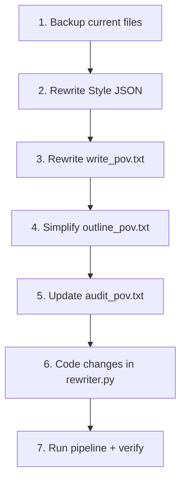

# POV Pipeline — Full Rebuild Plan

## Problem Statement

Chắp vá liên tục đã tạo ra hệ thống prompt có **27 xung đột** (mâu thuẫn giữa các files), **~81K chars token lãng phí** (~27% input), và output không ổn định. Root cause: mỗi rule được viết ở 3-4 chỗ khác nhau (style JSON + prompt + code inject) → AI đọc conflicting instructions → kết quả ngẫu nhiên.

**Giải pháp**: Rebuild toàn bộ 4 prompts + style JSON + code injection logic theo nguyên tắc **Single Source of Truth** — mỗi rule chỉ xuất hiện 1 lần, mỗi stage chỉ nhận data cần thiết.

## Design Principles

| # | Principle | Meaning |
|---|---|---|
| 1 | **Single Source of Truth** | Mỗi rule chỉ ở 1 nơi duy nhất |
| 2 | **Stage-Appropriate Data** | Mỗi AI stage chỉ nhận data nó cần |
| 3 | **No Style Leakage** | Style JSON chỉ gửi cho writer, không gửi cho planner/outliner/auditor |
| 4 | **Prompt = Structural Rules** | Prompt chứa rules về CẤU TRÚC (format, flow, constraints) |
| 5 | **Style JSON = Voice Rules** | Style JSON chứa rules về GIỌNG (vocabulary, rhythm, POV, closing types) |
| 6 | **No Contradictions** | Trước khi viết rule mới → audit toàn bộ pipeline |

---

## Current Architecture vs New Architecture

### Current (Broken)

```
Phase Plan AI receives:
  SYSTEM: phase_plan_pov.txt (8.9K) — event selection rules
  USER:   Style Guide (5K) ← UNNECESSARY
        + Blueprint (40K) ✓
        + Framework name ✓

Outline AI receives:
  SYSTEM: outline_pov.txt (8.3K) — outline structure rules
  USER:   Style Guide (5K) ← MOSTLY UNNECESSARY
        + Event timeline ✓
        + Blueprint (40K) ✓

Audit AI receives:
  SYSTEM: audit_pov.txt (2.7K) — audit checklist
  USER:   Style Guide (5K) ← UNNECESSARY
        + Blueprint (40K) ← UNNECESSARY
        + Outline (35K) ✓

Writer AI receives:
  SYSTEM: write_pov.txt (11.4K) — writing rules
        + Style Guide (5K) — voice rules
        + Filtered Blueprint (varies) ✓
        + FULL Outline (4K) ← UNNECESSARY
        + Chapter data ✓
        + Previous context ✓
  USER:   Write command (772 chars)
```

**Total wasted: ~81K chars/run**

### New (Clean)

```
Phase Plan AI receives:
  SYSTEM: phase_plan_pov.txt (≤8K) — event selection rules
  USER:   Blueprint (40K) ✓
        + Framework name ✓
        + Phase labels only ✓
  
  ❌ NO Style Guide

Outline AI receives:
  SYSTEM: outline_pov.txt (≤6K) — outline structure rules
           (contains ONLY metadata rules: opening/closing/structure types)
  USER:   Event timeline ✓
        + Blueprint (40K) ✓
        + Outline metadata rules (extracted from style, ~500 chars) ✓

  ❌ NO full Style Guide

Audit AI receives:
  SYSTEM: audit_pov.txt (≤3K) — audit checklist
  USER:   Outline only (35K) ✓

  ❌ NO Style Guide, NO Blueprint

Writer AI receives:
  SYSTEM: write_pov.txt (≤6K) — structural writing rules ONLY
        + Style Guide (5K) — voice rules (ONLY place it appears)
        + Filtered Blueprint (varies) ✓
        + Chapter data ✓
        + Previous context ✓
  USER:   Write command (772 chars)

  ❌ NO full outline
```

**Estimated savings: ~80K chars/run (~27%)**

---

## Proposed Changes

### Component 1: Style JSON — Separation of Concerns

#### [MODIFY] [narrative_pov_tiểu_sử.json](file:///f:/1.%20Edit%20Videos/8.AntiCode/2.Script_Split_Chapter/styles/narrative_pov_tiểu_sử.json)

**Goal**: Style JSON = ONLY voice/writing rules. Remove all structural/outline metadata.

**Changes**:
1. **KEEP** (writer-facing rules):
   - `core_rules`: identity, tone, sentence_rhythm, vocabulary, voice_over_clarity, pov_rules, data_density, zero_narrator_rule
   - `framework.pov_strategy`
   - `framework.language` (metaphor_family, sentence_style, forbidden)
   - `framework.steps` (phase definitions — for framework context)
   - `framework.emotional_arc`, `tension_curve`
   - `pipeline_features` (code-facing config)

2. **REMOVE** (moved to outline prompt or deleted):
   - `anti_framework_leak` → moved to write prompt CONSTRAINTS section
   - `chapter_ending_protocol` → moved to write prompt PART 4
   - `framework.hook` → simplified, merged into write prompt SPECIAL CHAPTERS
   - `framework.pacing.rule` (hardcoded chapter numbers "1-3, 4-7") → DELETE
   - `framework.pacing.chapter_rhythm` → moved to write prompt CHAPTER FLOW
   - `framework.outline_rules` → moved to outline prompt (only place it belongs)
   - `chapter_rhythm` (top-level) → DELETE (duplicate of outline_rules + chapter_ending_protocol)
   - `checklist` → DELETE (duplicate of write prompt rules)
   - `framework.technique_emphasis` → DELETE (redundant with vocabulary/identity)
   - `framework.counter_argument` → DELETE (useless)
   - `framework.weight_line_types` → moved to write prompt PART 4
   - `framework.anti_patterns` → DELETE (duplicates core_rules)
   - `anti_copy` → DELETE (useless rule)

3. **UNIFY Level Anchor rule** — ONE rule, ONE location:
   - Style JSON: `"chapter_design"` says "within first 2 sentences"
   - `hook.anchor` says "FIRST SENTENCE"
   - `body_chapter_opening` says "within first 2 sentences"
   - **DECISION**: Level anchor = **ALWAYS sentence 1**. Period. No THESIS/ATMOSPHERE variation.
   - **NEW rule** (write prompt only): `"Level {N}, {label}. You are {age}."` = first sentence of every chapter. No exceptions.

---

### Component 2: Phase Plan Prompt — Strip to Essentials

#### [MODIFY] [system_narrative_phase_plan_pov.txt](file:///f:/1.%20Edit%20Videos/8.AntiCode/2.Script_Split_Chapter/prompts/system_narrative_phase_plan_pov.txt)

**No changes needed to prompt itself** — it's already clean. 

**Code change**: Stop sending Style Guide in USER message.

---

### Component 3: Chapter Plan Prompt — No Changes

#### [KEEP] [system_narrative_chapter_plan_pov.txt](file:///f:/1.%20Edit%20Videos/8.AntiCode/2.Script_Split_Chapter/prompts/system_narrative_chapter_plan_pov.txt)

Already clean. No changes needed.

---

### Component 4: Outline Prompt — Remove Writer-Facing Rules

#### [MODIFY] [system_narrative_outline_pov.txt](file:///f:/1.%20Edit%20Videos/8.AntiCode/2.Script_Split_Chapter/prompts/system_narrative_outline_pov.txt)

**Changes**:
1. **KEEP**: LEVEL STRUCTURE, SCENE FIELDS, OUTPUT FORMAT, CRITICAL RULES
2. **SIMPLIFY**: CHAPTER TYPE / CLOSING TYPE / OPENING STYLE — keep definitions but remove examples that conflict with write prompt
3. **UNIFY opening rule**: "Level anchor = sentence 1 for ALL opening styles"
4. **REMOVE**: line 59-62 (BEAT references — writer concept, not outliner's job)
5. **ADD**: `event_cause` field requirement (currently only in chapter_plan, not explicitly in outline)

**Code change**: Stop sending full Style Guide. Only send:
- Phase labels (6 labels + descriptions) — extracted from style JSON by code
- Framework name

---

### Component 5: Audit Prompt — Strip Data, Restrict Scope

#### [MODIFY] [system_narrative_audit_pov.txt](file:///f:/1.%20Edit%20Videos/8.AntiCode/2.Script_Split_Chapter/prompts/system_narrative_audit_pov.txt)

**Changes**:
1. **ADD explicit scope restriction**: "You may ONLY reassign metadata (opening_style, closing_type, chapter_structure). You MUST NOT rewrite content (scene_open, scene_action, scene_close, summary, event_description)."
2. **REMOVE**: word count check (not auditor's job — writer handles)
3. **REMOVE**: vocabulary check (not auditor's job)

**Code change**: Stop sending Style Guide + Blueprint. Only send Outline.

---

### Component 6: Write Prompt — Single Source of Truth Rewrite

#### [REWRITE] [system_narrative_write_pov.txt](file:///f:/1.%20Edit%20Videos/8.AntiCode/2.Script_Split_Chapter/prompts/system_narrative_write_pov.txt)

**NEW structure** (each section appears ONCE):

```
HEADER: Identity, variables, chapter data
  - Style JSON, framework, blueprint, chapter outline
  - Previous context
  - ❌ NO full outline

SECTION 1 — POV CONTRACT (6 lines)
  - "You" = subject. Third person = everyone else.
  - Forbidden voices.

SECTION 2 — CHAPTER STRUCTURE (4 parts)
  PART 1: LEVEL ANCHOR — "Level N, label. You are age." (FIRST sentence, always)
  PART 2: CAUSE — Develop event_cause into POV setup (no sentence count limit)
  PART 3: SCENE — Develop scene_open/action/close. Weave sub_key_data + physical_state.
  PART 4: WEIGHT LINE — Close with what CHANGED / COST / LEARNED.
     Closing type (cold_fact/paradox/cost/weight) from outline = HOW to phrase.
     Content = WHAT to express (change/cost/lesson).
     ❌ REMOVE "WHAT IS COMING?" (contradicts "no forward tension")
     ❌ REMOVE sentence count limit ("1-2 sentences")

SECTION 3 — SPECIAL CHAPTERS (Level 1 + End chapter guidance)

SECTION 4 — CONSTRAINTS
  - TTS safety, framework leak ban, output format

❌ DELETED SECTIONS:
  - Opening styles menu (was redundant — outline already assigns, just follow outline)
  - CLOSING CONTENT RULE (Section 3 old) — merged into PART 4
  - Content Principles (redundant with Section 2)
  - "A chapter with only SCENE = observation report" line (redundant)
```

**Key simplifications**:
- From **234 lines** → target **~120 lines**
- From **6 sections** → **4 sections**
- Every rule appears **exactly once**
- No examples from specific characters (Baldwin, Genghis Khan)
- `scene_close` vs `weight_line` clarified: scene_close = immediate result, weight_line = what it COST

---

### Component 7: Code Changes

#### [MODIFY] [rewriter.py](file:///f:/1.%20Edit%20Videos/8.AntiCode/2.Script_Split_Chapter/core/rewriter.py)

**7 code changes**:

1. **`generate_narrative_phase_plan()`** (line ~4418):
   - REMOVE: `f"STYLE GUIDE:\n{compact_style}\n\n"` from `user_content`
   - KEEP: Blueprint + Framework name

2. **`generate_narrative_outline()`** (line ~5260):
   - REPLACE: Full Style Guide → extracted phase labels only (~500 chars)
   - Create helper: `_extract_phase_labels(style_json, framework_name)` → returns only phase definitions

3. **`audit_outline()`** (line ~5327):
   - REMOVE: Style Guide from `user_content`
   - REMOVE: Blueprint from `user_content`
   - KEEP: Only outline JSON

4. **`write_from_blueprint()`** (line ~5667):
   - REMOVE: `{full_outline}` replacement → replace with empty or delete from template
   - Style JSON still sent (this is the ONLY place)

5. **Write prompt template** (line 12-13):
   - REMOVE: `FULL OUTLINE (all chapters...): {full_outline}`

6. **`_extract_style_for_framework()`** — no changes (already extracts relevant framework)

7. **Previous context injection** — verify code doesn't inject fake Level anchors into `previous_context` that weren't in the actual output

---

## Open Questions

> [!IMPORTANT]
> **Q1**: Opening styles (STANDARD / THESIS / ATMOSPHERE) — hiện tại outline AI gán style cho mỗi chapter. Nếu Level anchor LUÔN ở sentence 1, thì THESIS ("bold statement first") và ATMOSPHERE ("physical environment first") có còn hợp lý không?
> 
> **Proposal**: Giữ 3 opening styles nhưng redefine:
> - STANDARD: `Level anchor → cause → scene`
> - THESIS: `Level anchor → bold statement → cause → scene` (bold statement ở sentence 2, không phải sentence 1)
> - ATMOSPHERE: `Level anchor → atmosphere sentence → cause → scene`
> 
> Tất cả bắt đầu bằng Level anchor. Sự khác biệt là **sentence 2**.

> [!IMPORTANT]
> **Q2**: `scene_close` vs `weight_line` — gộp thành 1 hay giữ 2?
>
> **Proposal**: Giữ 2 nhưng rõ ràng:
> - `scene_close` (từ outline) = **kết quả tức thì** của action ("Saladin retreats")
> - `weight_line` (writer tạo) = **what it COST** ("But the dead hand hangs at your side")
> - Writer phải viết cả 2: close the event THEN state the cost.

> [!WARNING]
> **Q3**: Audit hiện dùng `gemini-3-flash-preview` — nên giữ flash hay đổi sang pro? Flash rẻ hơn nhưng hay rewrite content (vi phạm scope).
>
> **Proposal**: Giữ flash nhưng thêm scope restriction vào prompt.

---

## Verification Plan

### Automated Tests
1. Run pipeline trên King Baldwin IV blueprint → so sánh output trước/sau
2. Check token count giảm: `SYSTEM + USER` size cho mỗi stage
3. Verify Level anchor xuất hiện ở sentence 1 của mọi chapter output
4. Verify `STYLE GUIDE` KHÔNG xuất hiện trong phase_plan + audit debug files

### Manual Verification
1. Đọc chapter output → verify 4-part structure (Anchor → Cause → Scene → Weight)
2. Đọc audit output → verify KHÔNG rewrite scene content
3. So sánh chất lượng narrative với biography pipeline

---

## Execution Order



| Step | File | Risk |
|---|---|---|
| 1 | Backup all POV files | None |
| 2 | `narrative_pov_tiểu_sử.json` | Medium — shared with UI |
| 3 | `system_narrative_write_pov.txt` | High — core writer prompt |
| 4 | `system_narrative_outline_pov.txt` | Medium — structural metadata |
| 5 | `system_narrative_audit_pov.txt` | Low — scope restriction only |
| 6 | `core/rewriter.py` | High — shared code, must protect biography |
| 7 | Test run | Verify output quality |

> [!CAUTION]
> **Biography Protection**: All code changes in `rewriter.py` MUST be gated behind `_is_pov` checks. The biography pipeline (`_is_biography`) must NOT be affected. See [Biography Pipeline Protection Rule KI](file:///C:/Users/Admin/.gemini/antigravity/knowledge/biography_protection_rule/artifacts/protection_rules.md).
