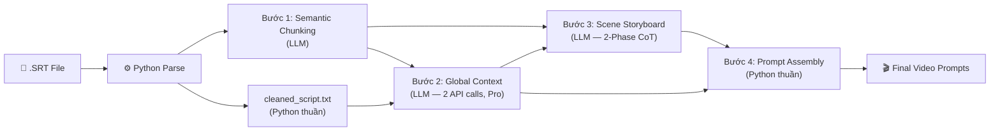

# Video Prompt Pipeline — Bản Kế hoạch Chi tiết (v5)

Pipeline tự động hóa chuyển đổi Script (SRT) → Video Prompts chuẩn hóa cho API sinh video (Veo3/Runway). Gồm **4 Module cốt lõi** + 1 **Reliability Engine**. Mọi dữ liệu luân chuyển giữa bước = **JSON**. Mỗi bước lưu checkpoint file.

> [!IMPORTANT]
> **Art Style** được chọn trước khi chạy pipeline (từ preset `.txt` files). Pipeline KHÔNG sinh art style — chỉ inject vào prompt cuối ở Bước 4.

---

## Data Flow Tổng quan



**Thứ tự thực thi:**
1. **Python Parse** → `cleaned_script.txt` + JSON sentences
2. **Bước 1** (LLM) → nhóm sentences thành Sequences
3. **Bước 2** (LLM, Pro, 2 calls) → Characters/Factions + Locations
4. **Bước 3** (LLM, 2-Phase CoT) → Sequences → Scenes
5. **Bước 4** (Python thuần) → Final prompts

---

## Tiền xử lý: Python SRT Parse (Không dùng AI)

**Input:** File `.srt`

**Xử lý:**
1. Parse SRT → `(index, start_time, end_time, text)`
2. **Merge & Interpolation:** Gộp SRT gãy vụn thành câu hoàn chỉnh (theo dấu chấm). Dùng **Linear Interpolation** tính lại `[start_time, end_time]` cho câu kẹt giữa 2 dòng subtitle.
3. Tính `duration = end_time - start_time`
4. Tạo `cleaned_script.txt` — text liền mạch, lột sạch timecode
5. Tạo JSON trung gian (gửi Bước 1), lột bỏ `start_time`/`end_time`:

```json
[
  {"sentence_id": 1, "text": "You are 18, 82 BC.", "duration": 2.4},
  {"sentence_id": 2, "text": "Sullah has seized Rome...", "duration": 6.6}
]
```

> Mốc `start_time`, `end_time` Python cất ở local. Khi AI trả `sentence_id` gộp lại → Python ráp mốc Start/End.

**Checkpoint:** `_step0_sentences.json`, `cleaned_script.txt`

---

## Bước 1: Macro Semantic Chunking (LLM)

**Mục tiêu:** Cắt danh sách câu thành **Sequence** (tối đa 25s, không có min) trọn vẹn Không gian + Nhân vật.

### 4 Quy tắc Chunking

| # | Quy tắc | Mô tả |
|---|---|---|
| 1 | **Không gian & Thời gian** (Ưu tiên #1) | Cắt khi Setting thay đổi (địa điểm, thời đại, ánh sáng) |
| 2 | **Chủ thể trọng tâm** (Subject Shift) | Cắt khi tiêu điểm đổi giữa nhóm/cá nhân |
| 3 | **Max 25s** | Vượt quá → chặt đôi. Không có giới hạn tối thiểu |
| 4 | **Ranh giới Ngữ nghĩa** | Cắt phải rơi trúng dấu chấm. Cấm cắt ngang câu |

### Output

```json
[
  {
    "sequence_id": "SEQ_01",
    "sentence_ids": [1, 2],
    "location_shift": "Sullah's Palace",
    "main_subject": "Sullah",
    "full_text": "You are 18, 82 BC. Sullah has seized Rome...",
    "total_duration": 8.9
  }
]
```

**Checkpoint:** `_step1_sequences.json`

---

## Bước 2: Global Context Analysis (LLM — 2 API Calls, Model Pro)

**Mục tiêu:** Quét kịch bản **một lần** để khóa nhân vật + bối cảnh. Tạo **2 file riêng** — characters (gen ảnh sheet) + locations (visual bible).

> [!WARNING]
> **Chốt chặn 5,000 từ:** Nếu `cleaned_script.txt` > 5,000 từ → dừng pipeline, cảnh báo.

### API Call 1 → `_step2_characters.json`

#### Characters (đầy đủ, không giới hạn số lượng)

| Nhóm | Tiêu chí | Output |
|---|---|---|
| **PROTAGONIST** | Nhân vật trung tâm | `visual_description` + `body_language` + `chapters` + `sheet_prompt` |
| **NAMED** | Nhân vật phụ có tên/chức danh | `visual_description` + `body_language` + `chapters` + `sheet_prompt` |

#### Factions (quần chúng/quân sự — chỉ mô tả chung)

| Field | Mô tả |
|---|---|
| `faction_name` | Tên phe |
| `uniform_description` | Đồng phục chung (1-2 câu) |
| `banner` | Cờ/phù hiệu |
| `appears_as` | Vai trò thường gặp |

### API Call 2 → `_step2_visual_bible.json`

LLM tự xác định locations từ script sạch (không dùng frequency pre-filter từ Bước 1 vì tên AI đặt không nhất quán).

```json
{
  "locations": [
    {
      "label": "Caesar's Villa",
      "bible_description": "Modest Roman villa with cracked stone walls...",
      "default_lighting": "Warm golden afternoon sunlight..."
    }
  ]
}
```

### Cách gửi vào Bước 3

Cả 2 file nhúng vào system prompt Bước 3 dưới dạng `=== VISUAL REFERENCE ===`.

**Checkpoint:** `_step2_characters.json` + `_step2_visual_bible.json`

---

## Bước 3: Micro Scene Storyboarding (LLM — 2-Phase CoT)

**Mục tiêu:** Đóng vai **Đạo diễn**, đập mỗi Sequence thành **Scenes** (3-6s) bằng tư duy điện ảnh.

### Dynamic Batching
- 1 Sequence max **25s**, 1 Batch max **60s** (1 API call)
- **Output format:** AI trả về **JSON array** — mỗi element cho 1 Sequence: `[{sequence_id: "SEQ_01", scenes: [...]}, ...]`

### Quy trình Tư duy 2 Pha (Chain-of-Thought)

> [!IMPORTANT]
> **Tại sao cần 2 Pha?** Nếu ném text cho AI và bảo "chia Scene", nó sẽ LƯỜI — dịch từng câu = 1 Scene (bẫy Slide PowerPoint). Để phá bẫy, ÉP AI **nghĩ trước khi làm** bằng cách viết `visual_event` TRƯỚC KHI chia Scene.

#### Pha 1 — Visual Event Synthesis
AI đọc **TOÀN BỘ** `full_text` của Sequence → tóm thành **MỘT SỰ KIỆN HÌNH ẢNH** duy nhất.

Ví dụ: `full_text` = *"Your family back the wrong side... His men strip your priesthood... They want every stone attached to your name."*
→ `visual_event`: *"Roman soldiers violently raiding Caesar's villa at night, stripping his belongings and destroying family symbols"*

> Khi `full_text` chứa **chuỗi hành động nối tiếp** (montage), AI chọn **1-2 hành động mạnh nhất về hình ảnh** để làm `visual_event`. Không cần cover hết mọi câu.

#### Pha 2 — Camera Cuts
Dựa trên `visual_event` → AI bẻ thành **3-4 GÓC MÁY** quay **CÙNG MỘT** sự kiện, cùng bối cảnh.

#### Quy tắc Chống Dịch 1:1
- **CẤM** tạo Scene dựa trên ranh giới câu văn
- Scenes phải là **các GÓC NHÌN KHÁC NHAU** của cùng 1 sự kiện
- `audio_sync` chỉ cho biết voiceover đang đọc tới đâu, **KHÔNG** quyết định nội dung hình ảnh

### 7 Quy tắc Đạo diễn (System Prompt)

#### Quy tắc 1: Khóa Cảnh (Location & Subject Lock)
Mọi hành động PHẢI diễn ra tại đúng `location_shift` và xoay quanh `main_subject` từ Bước 1. Khi ghi `locked_location`, sử dụng **CHÍNH XÁC** label từ `=== VISUAL REFERENCE: LOCATIONS ===` để đảm bảo Bước 4 lookup khớp.

#### Quy tắc 2: Toán Thời gian (Time Math)
- `sum(scene.duration)` = `total_duration` của Sequence
- Mỗi Scene: **3.0s — 6.0s**

#### Quy tắc 3: Phân loại A-Roll / B-Roll

| Loại | Định nghĩa |
|---|---|
| **A-Roll** | Hành động/Biểu cảm chính nhân vật trọng tâm |
| **B-Roll** | Môi trường, không gian, chi tiết vật thể |

#### Quy tắc 4: Dịch Vật Lý (Physical Action Only)
CẤM trừu tượng. Bắt buộc dịch ra sự kiện vật lý nhìn thấy.

> [!NOTE]
> **Ngôn ngữ:** `audio_sync` giữ ngôn ngữ gốc. Tất cả prompt fields **PHẢI tiếng Anh**.

#### Quy tắc 5: Khí quyển (Lighting / Mood)
Bóc tách ánh sáng + bầu không khí thành `lighting_and_atmosphere`.

#### Quy tắc 6: Yếu tố Nền (Background & Extras)
Bắt buộc mô tả quần chúng hoặc chuyển động môi trường. **Tham chiếu** `factions[]` từ VISUAL REFERENCE.

#### Quy tắc 7: Camera Motion

**Mặc định: `Static`.** 3 ngoại lệ:

| Tình huống | Cỡ cảnh | Camera Motion |
|---|---|---|
| **MỞ ĐẦU** Sequence mới | Wide | Slow Pan |
| Nhân vật **đang di chuyển** | Medium | Slow Tracking |
| Cảm xúc **cao trào** | Medium/Close-up | Extreme Slow Zoom In |

CẤM Pan ở Close-up. CẤM 2 hướng đối nghịch liền kề (Vector Continuity).

### Output

```json
{
  "sequence_id": "SEQ_02",
  "total_sequence_duration": 14.0,
  "locked_location": "Caesar's Villa",
  "visual_event": "Roman soldiers violently raiding Caesar's villa at night, stripping his belongings and destroying family symbols",
  "scenes": [
    {
      "global_scene_id": "SEQ_02_SCN_01",
      "duration": 4.0,
      "audio_sync": "Your family back the wrong side of his war and Sullah remembers everything.",
      "character_labels": [],
      "faction_labels": ["Roman Legionaries"],
      "shot_type": "Wide Shot",
      "roll_type": "B-Roll",
      "camera_motion": "Slow Pan",
      "lighting_and_atmosphere": "Dark moody shadows, flickering warm torchlight, tense and claustrophobic.",
      "background_and_extras": "Silhouettes of soldiers in bronze segmented armor standing by the doorway.",
      "physical_action": "Villa door kicked open by armored boots, torchlight flooding into dark courtyard."
    },
    {
      "global_scene_id": "SEQ_02_SCN_02",
      "duration": 5.0,
      "audio_sync": "His men strip your priesthood. They confiscate your wife Cornelia's dowy.",
      "character_labels": [],
      "faction_labels": ["Roman Legionaries"],
      "shot_type": "Medium Close-up",
      "roll_type": "B-Roll",
      "camera_motion": "Static",
      "lighting_and_atmosphere": "Cold moonlight, chaotic and violent mood.",
      "background_and_extras": "Broken furniture and scattered gold coins on marble floor.",
      "physical_action": "Armored hands violently sweeping ornate vases and jewelry boxes off a marble table."
    },
    {
      "global_scene_id": "SEQ_02_SCN_03",
      "duration": 5.0,
      "audio_sync": "They want every stone attached to your name.",
      "character_labels": [],
      "faction_labels": ["Roman Legionaries"],
      "shot_type": "Low Angle Shot",
      "roll_type": "B-Roll",
      "camera_motion": "Static",
      "lighting_and_atmosphere": "Dusty air filled with marble particles, harsh contrast lighting.",
      "background_and_extras": "Destroyed courtyard with scattered scrolls blowing in wind.",
      "physical_action": "Roman soldiers swinging heavy metal hammers, smashing a white marble family statue."
    }
  ]
}
```

### Python Validation

| Sai số | Hành động |
|---|---|
| ≤ 10% | **Auto-fix** bằng Smart Tail Correction |
| > 10% | **Reject** → retry (max 2 lần) |

#### Validation `audio_sync` Coverage
Nối tất cả `audio_sync` text → so sánh với `full_text` gốc. Nếu thiếu text → ghi warning log (không reject).

**Smart Tail Correction:** Cộng/trừ `diff` vào scene cuối. Nếu vượt 6s hoặc dưới 3s → phân bổ đều cho 2-3 scene cuối.

**Checkpoint:** `_step3_scenes.json`

---

## Bước 4: Prompt Assembly (Python thuần)

### Input
1. `_step3_scenes.json`
2. `_step2_characters.json` + `_step2_visual_bible.json`
3. Art Style preset (`.txt` → `Mandatory Style` + `Negative Prompt`)
4. Constraint files (`constraint_safety.txt`, `constraint_quality.txt`, `constraint_historical.txt`)

### Logic Assembly
1. `character_labels[]` → lookup `characters[]` → inject `visual_description`
2. `faction_labels[]` → lookup `factions[]` → inject `uniform_description`
3. `locked_location` → lookup `locations[].label` → inject `bible_description`
4. Art Style → trích `Mandatory Style` keywords
5. Negative Prompt → trích từ file style
6. Constraints → nối 3 file `.txt`

### Output — Final Prompt JSON

```json
{
  "global_scene_id": "SEQ_02_SCN_01",
  "character_labels": [],
  "faction_labels": ["Roman Legionaries"],
  "shot_type": "Wide Shot",
  "camera_motion": "Slow Pan",
  "roll_type": "B-Roll",
  "subject_action": "Villa door kicked open by armored boots, torchlight flooding into dark courtyard.",
  "background_and_extras": "Silhouettes of soldiers in bronze segmented armor standing by the doorway.",
  "location": "Modest Roman villa with cracked stone walls, narrow arched doorway, terracotta roof tiles",
  "lighting_and_atmosphere": "Dark moody shadows, flickering warm torchlight, tense and claustrophobic.",
  "mandatory_style": "[Style keywords from preset .txt]",
  "negative_prompt": "[Negative keywords from preset .txt]",
  "constraints": "[Safety + Quality + Historical constraints]"
}
```

> `character_labels` giữ lại để tham chiếu ảnh Character Sheet.

**Checkpoint:** `_step4_final_prompts.json`

---

## Reliability Engine

| Tầng | Kỹ thuật |
|---|---|
| 1. **Structured Outputs** | `response_format={"type": "json_schema"}` — xác suất lỗi ~0% |
| 2. **Regex Stripping** | `try_parse()` lột ` ```json ``` ` |
| 3. **Retry Fallback** | Gửi JSON lỗi lại + "Fix syntax" — max **2 lần** |

---

## Checkpoint & Resume

| File | Bước | Dữ liệu |
|---|---|---|
| `_step0_sentences.json` + `cleaned_script.txt` | Tiền xử lý | Câu + timing + script sạch |
| `_step1_sequences.json` | Bước 1 | Sequences |
| `_step2_characters.json` | Bước 2, Call 1 | Characters + Factions |
| `_step2_visual_bible.json` | Bước 2, Call 2 | Locations |
| `_step3_scenes.json` | Bước 3 | Scenes |
| `_step4_final_prompts.json` | Bước 4 | Final prompts |

---

## Tổng kết Quyết định Thiết kế

| # | Quyết định | Lý do |
|---|---|---|
| 1 | Bước 2 chạy **SAU** Bước 1 | Cần metadata Bước 1 |
| 2 | Bước 2 = **2 API calls, Pro** | File riêng: characters (gen ảnh) + locations (visual bible) |
| 3 | Characters liệt kê **đầy đủ** + `chapters[]` + `sheet_prompt` | Gen ảnh reference |
| 4 | Factions → `uniform_description` chung | Không cần sheet riêng |
| 5 | Location do **LLM Bước 2 tự xác định** | Tên AI Bước 1 không nhất quán |
| 6 | **2-Phase CoT** ở Bước 3 | Phá bẫy dịch 1:1, ép tư duy đạo diễn |
| 7 | `audio_sync` thay `matched_text` | Voiceover position ≠ visual content |
| 8 | **Chống dịch 1:1** | Scenes = góc máy, không phải minh họa từng câu |
| 9 | Montage → chọn **1-2 hành động mạnh nhất** | Không cần cover hết mọi câu |
| 10 | Sequence max **25s** (không có min) | Sweet spot |
| 11 | Camera Motion mặc định **Static** | 3 ngoại lệ duy nhất |
| 12 | Validation 2 tầng: ≤10% / >10% | Đơn giản |
| 13 | Art Style = **preset**, Constraints = **3 file .txt** | Inject ở Bước 4 |
| 14 | Final JSON giữ `character_labels` | Tham chiếu ảnh sheet |
