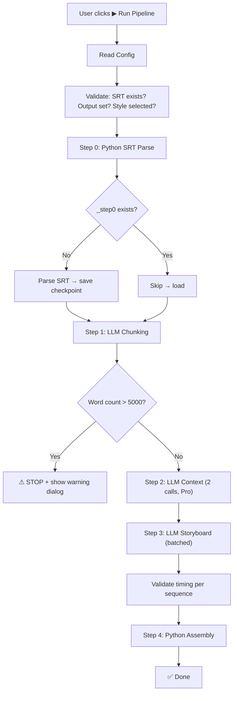

# Video Prompt Pipeline — Logic Audit + UI Design

---

## Part 1: Internal Logic Audit (v5)

Đánh giá logic, pipeline flow, tính khả thi — KHÔNG so sánh với plan gốc.

### ✅ Điểm mạnh

| # | Điểm | Đánh giá |
|---|---|---|
| 1 | **Data flow rõ ràng** | JSON giữa mỗi bước, không có chỗ mơ hồ |
| 2 | **2-Phase CoT** | Giải quyết triệt để bẫy dịch 1:1 |
| 3 | **Checkpoint/Resume** | Mỗi bước có file riêng, resume an toàn |
| 4 | **Validation + Tail Correction** | Đảm bảo tổng duration khớp 100% audio |
| 5 | **Tách Character/Location thành 2 file** | Linh hoạt: gen ảnh sheet + visual bible độc lập |

### 🔴 Vấn đề phát hiện

#### Vấn đề 1: Bước 1 output thiếu `sentence_ids`
**Hiện trạng:** Output Bước 1 có `sentence_ids: [1, 2]` nhưng Bước 3 KHÔNG nhận được field này. Bước 3 chỉ nhận `full_text` + `total_duration`.

**Hệ quả:** Bước 4 cần ráp `start_time`/`end_time` cho mỗi scene. Nhưng scene chỉ có `audio_sync` (text trích dẫn) — Python phải fuzzy-match text này với các câu gốc để tìm lại timing.

**Giải pháp:** Python ở Bước 4 dùng `audio_sync` text → match với `sentence_ids` từ `_step1_sequences.json` → ráp timing. Hoặc đơn giản: dùng `sequence.start_time` + tính cộng dồn `scene.duration` lần lượt để xác định start/end mỗi scene.

> **Kết luận: KHÔNG phải bug.** Python tự tính bằng phép cộng dồn duration.

#### Vấn đề 2: `locked_location` trong Bước 3 vs `locations[].label` ở Bước 2
**Hiện trạng:** Bước 1 đặt `location_shift: "Sullah's Palace"`. Bước 2 LLM tự xác định locations, có thể label `"Sullah's Throne Room"`. Bước 3 ghi `locked_location` từ Bước 1.

**Hệ quả:** Bước 4 cần match `locked_location` với `locations[].label` nhưng tên KHÔNG khớp.

**Giải pháp:** Bước 3 nhận VISUAL REFERENCE (locations từ Bước 2) trong prompt → AI Bước 3 sẽ dùng ĐÚNG label từ Bước 2 khi ghi `locked_location`. Cần ghi rõ trong system prompt Bước 3: *"Sử dụng CHÍNH XÁC label từ VISUAL REFERENCE khi ghi locked_location"*.

> **Kết luận: Cần bổ sung 1 dòng instruction vào prompt Bước 3.**

#### Vấn đề 3: Thiếu xử lý khi AI trả `character_labels` sai label
**Hiện trạng:** AI Bước 3 ghi `character_labels: ["Roman-Commander-A"]`. Bước 4 lookup trong `characters[]`. Nếu AI ghi sai chính tả label → lookup fail.

**Giải pháp:** Bước 4 Python dùng fuzzy match (hoặc Levenshtein distance) nếu exact match fail. Ghi warning log. Nếu không tìm được → bỏ qua inject, ghi lỗi.

> **Kết luận: Edge case, xử lý bằng fallback code.**

#### Vấn đề 4: `audio_sync` — AI có thể bỏ qua hoặc ghi sai
**Hiện trạng:** AI Bước 3 cần ghi `audio_sync` bao phủ toàn bộ `full_text` — tổng text trong tất cả `audio_sync` phải = `full_text`. Nếu AI bỏ sót 1 câu → voiceover không khớp.

**Giải pháp:** Python Validation sau Bước 3: nối tất cả `audio_sync` text → so sánh với `full_text`. Nếu thiếu text → ghi warning.

> **Kết luận: Cần thêm validation check cho `audio_sync` coverage.**

#### Vấn đề 5: Dynamic Batching — Batch chứa nhiều Sequences nhưng output phải tách riêng
**Hiện trạng:** 1 API call gửi 3 Sequences (25s + 20s + 10s). AI phải trả về 3 JSON objects riêng biệt, mỗi cái cho 1 Sequence.

**Giải pháp:** Dùng JSON array wrapper. Schema bắt AI trả `[{sequence_id: "SEQ_01", scenes: [...]}, {sequence_id: "SEQ_02", scenes: [...]}]`. Structured Outputs sẽ đảm bảo format đúng.

> **Kết luận: Cần schema rõ ở Reliability Engine.**

### Tổng kết Audit

| Vấn đề | Mức | Giải pháp | Cần sửa plan? |
|---|---|---|---|
| 1. Timing scenes | 🟢 Không phải bug | Cộng dồn duration | Không |
| 2. Location label mismatch | 🟡 Cần instruction | Thêm 1 dòng prompt | **Có** |
| 3. Character label typo | 🟢 Edge case | Fuzzy match fallback | Không |
| 4. audio_sync coverage | 🟡 Cần validation | Thêm check Python | **Có** |
| 5. Batch output format | 🟡 Cần specify | Schema JSON array | **Có** |

---

## Part 2: UI Design — Tab 🎬 Video Prompt

### Kiến trúc

Tạo Tab 3 trong `QTabWidget` hiện có, pattern tương tự `ProductTab` (self-contained widget):
- File mới: `ui/video_prompt_tab.py`
- Class: `VideoPromptTab(QWidget)`
- Đăng ký trong `main_window.py` → `self.tabs.addTab(video_tab, "🎬 Video Prompt")`

### Layout Overview

```
┌──────────────────────────────────────────────────────────────────┐
│ 🎬 Video Prompt Pipeline                                        │
├──────────────────────────────────────────────────────────────────┤
│ ┌─── Config Section ─────────────────────────────────────────┐  │
│ │ LEFT COLUMN                  │ RIGHT COLUMN                │  │
│ │ 📄 SRT Input: [path] [...]   │ ⚡ Tier B2: [Pro ▼]        │  │
│ │ 📁 Output:    [path] [...]   │ 🧵 Threads: [2]            │  │
│ │ 🎨 Style:     [combo ▼]      │ ☑ Log API                  │  │
│ │    [Refresh] [Open] [Preview]│ 💾 Save Config              │  │
│ │ ⚙ Constraints:               │                            │  │
│ │   ☑ Safety ☑ Quality         │                            │  │
│ │   ☑ Historical               │                            │  │
│ └──────────────────────────────┴────────────────────────────┘  │
│                                                                  │
│ ┌─── Pipeline Progress ─────────────────────────────────────┐  │
│ │ Step 0: SRT Parse          [✅ Done] [👁 View]             │  │
│ │ Step 1: Semantic Chunking  [⏳ Running...] [👁 View]       │  │
│ │ Step 2a: Characters+Fac    [⬜ Pending]                    │  │
│ │ Step 2b: Visual Bible      [⬜ Pending]                    │  │
│ │ Step 3: Storyboarding      [⬜ Pending]                    │  │
│ │ Step 4: Prompt Assembly    [⬜ Pending]                    │  │
│ │                                                            │  │
│ │ ⚠ Script: 3,200 words (OK)   📊 Sequences: 12 | Scenes: 38│  │
│ └────────────────────────────────────────────────────────────┘  │
│                                                                  │
│ ┌─── Actions ────────────────────────────────────────────────┐  │
│ │ [▶ Run Pipeline] [⏯ Resume] [■ Stop]  [📂 Open] [📋 View] │  │
│ └────────────────────────────────────────────────────────────┘  │
│                                                                  │
│ ┌─── Log ────────────────────────────────────────────────────┐  │
│ │ [timestamp] Parsing SRT...                                 │  │
│ │ [timestamp] 14 sentences, 47.8s total                      │  │
│ │ [timestamp] Step 1: 4 sequences created                    │  │
│ │ [🗑 Clear] [📋 Copy]                               ● Ready │  │
│ └────────────────────────────────────────────────────────────┘  │
└──────────────────────────────────────────────────────────────────┘
```

---

### Config Section — Chi tiết Controls

#### Left Column

| Control | Widget | Mặc định | Mô tả |
|---|---|---|---|
| **📄 SRT Input** | `QLineEdit` + `QPushButton(...)` | (trống) | Chọn file `.srt` input |
| **📁 Output** | `QLineEdit` + `QPushButton(...)` | Auto-derive | Thư mục lưu checkpoint + final |
| **🎨 Style** | `SearchableCombo` + Refresh/Open/Preview | (chọn) | Style preset `.txt` |
| **⚙ Constraints** | 3x `QCheckBox` | Quality ✅, Safety ✅ | Safety, Quality, Historical |

#### Right Column

| Control | Widget | Mặc định | Mô tả |
|---|---|---|---|
| **⚡ Tier (Bước 2)** | `QComboBox` ["Flash", "Pro"] | **Pro** | Model cho Bước 2 (luôn Pro) |
| **⚡ Tier (Bước 1,3)** | `QComboBox` ["Flash", "Pro"] | **Flash** | Model cho Bước 1 + 3 |
| **🧵 Threads** | `QSpinBox(1-8)` | 2 | Song song hóa Bước 3 batches |
| **☑ Log API** | `QCheckBox` | Off | Ghi log raw API request/response |
| **💾 Save Config** | `QPushButton` | — | Lưu config → `video_config.json` |

---

### Pipeline Progress Section

Widget: custom `QWidget` chứa 6 rows, mỗi row = 1 step.

| Row | Tên | Status Widget | Buttons |
|---|---|---|---|
| Step 0 | SRT Parse | `QLabel` (✅/⏳/❌) | `[👁 View]` → mở `_step0_sentences.json` |
| Step 1 | Semantic Chunking | `QLabel` | `[👁 View]` → mở `_step1_sequences.json` |
| Step 2a | Characters + Factions | `QLabel` | `[👁 View]` → mở `_step2_characters.json` |
| Step 2b | Visual Bible | `QLabel` | `[👁 View]` → mở `_step2_visual_bible.json` |
| Step 3 | Scene Storyboard | `QLabel` | `[👁 View]` → mở `_step3_scenes.json` |
| Step 4 | Prompt Assembly | `QLabel` | `[👁 View]` → mở `_step4_final_prompts.json` |

**Status icons:**
- ⬜ Pending
- ⏳ Running...
- ✅ Done (file exists)
- ❌ Failed
- ⏭ Skipped (resume)

**Footer stats row:**
- `⚠ Script: X,XXX words (OK / WARNING >5000)`
- `📊 Sequences: N | Scenes: N | Total: Xs`

---

### Actions Section

| Button | Color | Hành động |
|---|---|---|
| **▶ Run Pipeline** | 🟢 `#16A34A` | Chạy toàn bộ pipeline từ đầu |
| **⏯ Resume** | 🔵 `#2563EB` | Đọc checkpoint files, skip bước đã xong |
| **■ Stop** | 🔴 `#DC2626` | Dừng pipeline, giữ checkpoints |
| **📂 Open Output** | 🟠 `#D97706` | Mở thư mục output |
| **📋 View Final** | 🟣 `#7C3AED` | Mở `_step4_final_prompts.json` |

---

### Log Section
Dùng lại `LogSection` hiện có (giống Tab 1/2).

---

### Data Flow: UI → Pipeline



---

### Config Persistence

File: `video_config.json` (riêng, không chung với `config.json` của Tab 1)

```json
{
  "srt_input": "C:/path/to/script.srt",
  "output_dir": "C:/path/to/output",
  "style": "OverSimplified Cartoon",
  "tier_step2": "Pro",
  "tier_step13": "Flash",
  "threads": 2,
  "log_api": false,
  "constraint_safety": true,
  "constraint_quality": true,
  "constraint_historical": true
}
```

---

### Threading Model

| Bước | Threading | Lý do |
|---|---|---|
| Step 0 | Main (nhanh) | Python thuần, < 1s |
| Step 1 | Background thread | 1 API call |
| Step 2 | Background thread | 2 API calls tuần tự |
| Step 3 | **ThreadPoolExecutor(N)** | N batches song song, mỗi batch 1 API call |
| Step 4 | Main (nhanh) | Python thuần, < 1s |

- Thread-safe logging via `pyqtSignal` (giống pattern hiện tại)
- Stop flag: `threading.Event` checked mỗi batch
- Resume: check file exists → skip
