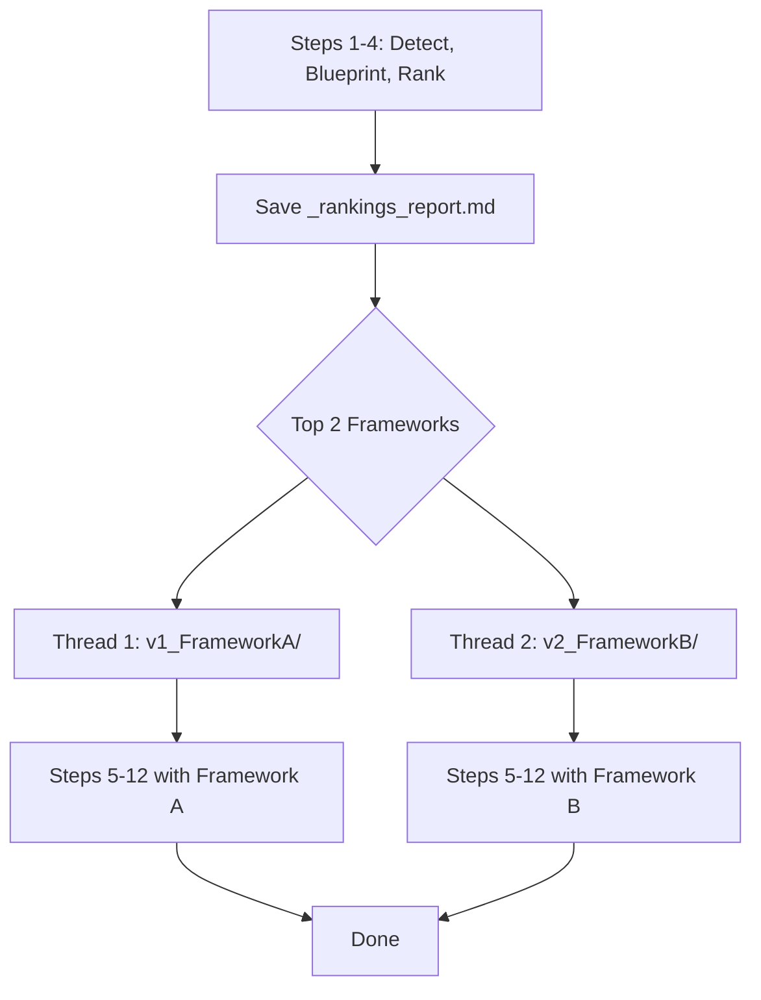

# Dual-Framework Auto Pipeline

Auto Pipeline tự chọn top 2 framework, chạy song song 2 version, lưu report xếp hạng.

## Proposed Changes

### Pipeline Flow (New)



**Shared Steps 1-4** (run once):
1. Concatenate text
2. Detect original framework
3. Extract blueprint
4. Rank all frameworks → **auto-pick top 2** (skip popup)

**Parallel Steps 5-12** (run x2):
- Each thread gets its own `output_dir`: `v1_frameworkName/` and `v2_frameworkName/`
- Each has its own `_pipeline/` subfolder
- Both share the same `blueprint` and `style_data` (read-only)

---

### Output Structure

```
style_rewrite/
├── _rankings_report.md          # Markdown report: all frameworks ranked
├── v1_Product Showdown/         # Version 1
│   ├── _pipeline/
│   ├── ch_01_intro.txt
│   └── ...
├── v2_Deep Dive Analysis/       # Version 2
│   ├── _pipeline/
│   ├── ch_01_intro.txt
│   └── ...
```

---

### Component Changes

#### [MODIFY] [rewrite_style_tab.py](file:///F:/1.%20Edit%20Videos/8.AntiCode/2.Script_Split_Chapter/ui/rewrite_style_tab.py)

**`_do_renew_review`** — Add `_auto_dual` mode:
- When `job.get("_auto_dual")` is True:
  - Skip framework popup (steps 4b)
  - After ranking (step 4), auto-select top 2
  - Generate `_rankings_report.md` in parent output dir
  - Fork 2 threads via `ThreadPoolExecutor(max_workers=2)`
  - Each thread runs Steps 5-12 with different `output_dir` and `selected_fw`
  - Wait for both to finish

**`_do_renew_style`** — Same approach:
- When `_auto_dual` in job: skip popup, fork 2 threads

#### [MODIFY] [auto_pipeline_tab.py](file:///F:/1.%20Edit%20Videos/8.AntiCode/2.Script_Split_Chapter/ui/auto_pipeline_tab.py)

- Add `_auto_dual = True` to job dict when creating rewrite jobs
- This flag signals `_do_renew_review`/`_do_renew_style` to use dual mode

---

### Rankings Report Format (`_rankings_report.md`)

```markdown
# Framework Rankings Report

**Video**: The 8 Most Reliable Lever Action Rifles
**Original Framework**: Product Showdown (confidence: 92%)
**Date**: 2026-03-24

## Rankings

| # | Framework | Score | Reason |
|---|-----------|-------|--------|
| 1 | Product Showdown | 9.5 | Phù hợp nhất cho review so sánh nhiều sản phẩm |
| 2 | Deep Dive Analysis | 8.2 | Tốt cho phân tích chuyên sâu từng sản phẩm |
| 3 | Countdown List | 6.1 | Cấu trúc đếm ngược quá cứng nhắc |

## Selected for Dual Write
- **v1**: Product Showdown (Score: 9.5)
- **v2**: Deep Dive Analysis (Score: 8.2)
```

---

> [!IMPORTANT]
> Tính năng dual-framework chỉ áp dụng khi Auto Pipeline gọi (job có `_auto_dual`).
> Khi chạy thủ công từ Style Rewrite tab, popup chọn framework vẫn hoạt động bình thường.

## Verification Plan

### Manual Verification
- Run Auto Pipeline with 1 URL
- Verify 2 output folders created with correct names
- Verify `_rankings_report.md` content
- Verify both versions complete successfully
